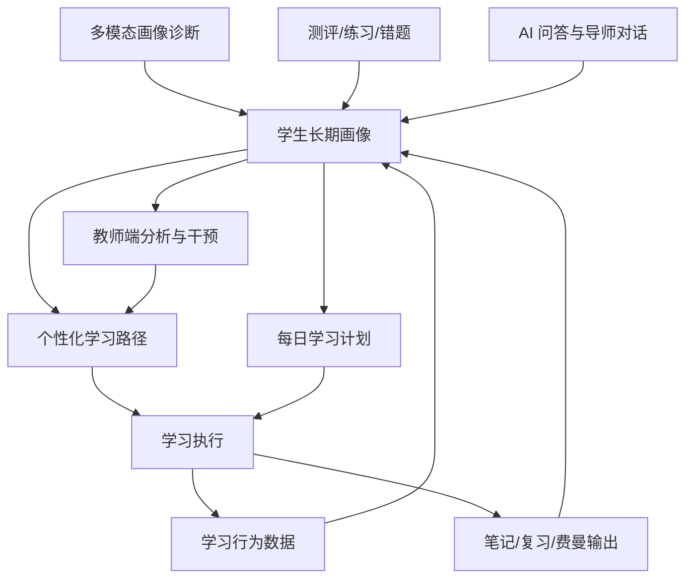

# EduSmart 智能学习平台项目计划书

## 1. 项目定位

EduSmart 是一个以“学生长期成长画像”为核心的智能学习平台。平台不是只提供课程、题库或 AI 问答，而是围绕学生的学习目标、知识基础、学习习惯、认知偏好、情绪状态、答题表现和学习过程，持续建立个人画像，并用画像驱动个性化学习路径、每日学习计划、AI 陪伴辅导、复习维护和教师干预。

平台的核心闭环是：

学生画像诊断 → 学习情况分析 → 个性化路径生成 → 学习计划执行 → AI 问答/练习/笔记/复盘 → 行为数据回写 → 学生画像持续修正 → 新一轮路径和计划优化。

## 2. 建设目标

### 2.1 当前阶段目标

1. 保留并梳理现有功能，不破坏已有认证、诊断、路径、教师端、RAG、AI 导师、笔记和报告能力。
2. 统一“学生画像”作为平台核心数据资产，让所有智能功能都能读取和更新画像。
3. 将个性化学习路径从“静态推荐”升级为“画像驱动 + 学习行为反馈驱动”的动态系统。
4. 建立学习陪伴机制，让 AI 不只是回答问题，而是能持续维护学生状态、提醒复习、发现掉队风险、推荐下一步行动。

### 2.2 最终效果目标

学生进入平台后，系统能够先诊断“这个学生是谁、现在会什么、适合怎么学、目标是什么、哪里容易卡住”，然后自动生成个性化学习路径和每日学习计划。在学习过程中，学生的答题、提问、笔记、复习、路径完成情况都会反向修正画像。时间越久，平台越了解学生，推荐越精准，陪伴越自然。

## 3. 总体功能架构

平台分为八个核心功能域：

1. 多模态学生画像诊断
2. 学习情况分析与能力评估
3. 个性化学习路径设计
4. 个性化学习计划设计
5. AI 问答与学习陪伴
6. 练习、测评与错题闭环
7. 智能笔记、复习与长期记忆维护
8. 教师端监督、干预与路径发布

这些功能不是孤立模块，而是围绕学生画像形成一个完整闭环。

## 4. 核心功能设计

### 4.1 多模态学生画像诊断

功能介绍：

学生画像是平台的核心。系统通过问卷、自然语言输入、答题记录、学习行为、AI 对话、笔记内容、语音或图片等多种方式采集学生信息，生成并持续更新个人画像。

画像内容包括：

- 基本信息：专业、年级、学习目标、兴趣方向。
- 知识基础：不同学科、知识点、能力维度的掌握情况。
- 学习风格：视觉型、听觉型、读写型、实践型等。
- 学习习惯：每日可用时间、专注时长、最佳学习时段、复习习惯。
- 认知状态：理解能力、迁移能力、应用能力、元认知水平。
- 情绪与动机：学习韧性、焦虑水平、动力来源、拖延风险。
- 薄弱点：错题集中知识点、频繁提问内容、长期未掌握概念。
- 个性化偏好：喜欢视频、图解、项目、讲解、练习、讨论等资源形式。

现有能力：

- 已有诊断接口和画像表。
- 已有自然语言快速诊断。
- 已有认知画像、学习偏好、诊断历史等数据表。

后续开发建议：

- 统一 `student_profiles` 为长期画像主表。
- 增加画像证据日志，记录每次画像变化来自问卷、答题、AI 对话还是学习行为。
- 增加多模态输入入口，例如语音描述、错题图片、笔记截图。
- 增加画像版本对比，展示“最近一周你的画像发生了什么变化”。

实现效果：

学生第一次使用时可以快速建立基础画像；长期使用后，画像会越来越精细，系统能知道学生适合什么节奏、哪类内容容易掌握、哪些知识点需要反复维护。

### 4.2 学习情况分析与能力评估

功能介绍：

系统根据答题、测试、课程进度、路径完成率、错题、笔记复习情况，对学生当前学习状态进行分析。

分析内容包括：

- 当前总体掌握度。
- 各知识点掌握情况。
- 薄弱知识点排行。
- 学习效率变化。
- 学习连续性和投入时间。
- 错因类型。
- 最近学习风险，例如长期未复习、连续答错、计划执行率下降。

现有能力：

- 已有诊断结果、认知画像、知识追踪、误区检测、报告生成等接口。
- 已有部分学习行为表、答题记录、笔记和费曼复盘记录。

后续开发建议：

- 建立统一的学习事件流，例如 `learning_events` 作为所有行为的入口。
- 将答题、问答、笔记、复习、路径完成都转为可分析事件。
- 增加“学习状态仪表盘”，展示近期趋势，而不是只显示静态分数。

实现效果：

系统不只知道学生“答对了几题”，还知道学生为什么错、最近是否进步、是否需要调整路径、是否需要教师介入。

### 4.3 个性化学习路径设计

功能介绍：

学习路径是从目标到知识掌握的长期路线。系统根据学生画像、知识图谱、掌握度、前置依赖和学习目标，生成适合该学生的路径。

路径应考虑：

- 学生目标：考研、就业、课程考试、项目能力提升等。
- 当前基础：已经掌握什么，还缺什么。
- 知识依赖：先学什么，再学什么。
- 学习风格：视频、图解、文档、实验、项目的比例不同。
- 可用时间：路径长度和每日任务量不同。
- 专注时长：长任务需要拆分。
- 薄弱点：低掌握度知识点优先补救。

现有能力：

- 已有 `/api/ai/learning-path` 路径生成接口。
- 已有 `AIPathGenerator`。
- 已有知识节点、题库、部分教师路径能力。

当前需要修正的问题：

- 路径生成器需要真正读取诊断画像中的学习风格、专注时长和偏好字段。
- 路径接口应返回个性化依据，让用户知道为什么推荐这些内容。
- 知识点表和题库表需要统一映射，避免路径和练习使用两套 ID。

后续开发建议：

- 增加路径版本管理，支持“重新规划”和“保留历史路径”。
- 增加路径调整触发规则，例如连续错题、计划未完成、AI 问答频繁卡住。
- 增加路径解释功能：每个节点说明“为什么你现在要学这个”。

实现效果：

不同学生即使目标相同，也会得到不同路径。基础弱的学生先补前置概念，实践型学生多项目任务，视觉型学生多图解和视频，时间少的学生路径会更短、更分块。

### 4.4 个性化学习计划设计

功能介绍：

学习计划是路径的短期执行安排。路径解决“学什么顺序”，计划解决“今天、明天、本周具体做什么”。

计划内容包括：

- 今日学习任务。
- 每个任务的预计时间。
- 任务类型：讲解、练习、实验、复习、笔记、费曼输出。
- 优先级。
- 完成状态。
- 下一次复习时间。

现有能力：

- 已有 `study_tasks`、`study_plans`。
- 已有 AI 生成计划接口和任务展示能力。

后续开发建议：

- 将学习计划与路径节点绑定。
- 根据学生可用时间和专注时长自动拆分任务。
- 根据完成情况动态滚动计划，而不是每天固定生成。
- 增加计划失败后的补救策略，例如任务自动延后、降低难度、请求 AI 辅导。

实现效果：

学生每天打开首页就能看到“今天该做什么”，不需要自己决定学习顺序。计划完成情况会影响画像，画像变化又会影响后续计划。

### 4.5 AI 问答与学习陪伴

功能介绍：

AI 问答不是独立聊天窗口，而是学生学习过程中的长期导师。它应读取学生画像、当前路径、最近错题、笔记和学习目标，给出有上下文的解释、追问和建议。

AI 陪伴能力包括：

- 知识讲解。
- 苏格拉底式追问。
- 错题讲解。
- 学习计划建议。
- 复习提醒。
- 情绪支持。
- 费曼输出评价。
- 根据对话发现新薄弱点并更新画像。

现有能力：

- 已有导师消息接口。
- 已有 RAG 问答接口。
- 已有本地 LLM 接入。
- 已有费曼复盘和智能卡片功能。

后续开发建议：

- AI 回答前读取学生画像和当前路径。
- AI 对话后生成画像更新建议，例如“学生多次问递归，递归薄弱度提高”。
- 增加“陪伴状态”，例如今日未学习提醒、复习到期提醒、连续错误安抚。
- 将 RAG 证据、课程内容和画像结合，避免泛泛回答。

实现效果：

学生感受到的是一个长期了解自己的学习助手，而不是每次都重新开始的聊天机器人。

### 4.6 练习、测评与错题闭环

功能介绍：

练习和测评用于验证学习效果，并反向修正画像。系统应根据路径节点和薄弱点推送题目，答题后更新知识掌握度。

功能内容包括：

- 专项练习。
- 阶段测试。
- 自适应诊断。
- 错题本。
- 错因分析。
- 相似题推荐。
- 掌握度更新。

现有能力：

- 已有题库、诊断测试、知识追踪、误区检测、练习提交能力。

后续开发建议：

- 修复题库字段和代码字段不一致问题。
- 将错题结果统一写入画像和学习事件。
- 增加错因分类：概念不清、条件遗漏、计算错误、迁移失败、粗心等。
- 根据错因生成不同补救任务。

实现效果：

学生每次练习都不是孤立记录，而会改变系统对他的理解，并影响后续路径、计划和 AI 辅导策略。

### 4.7 智能笔记、复习与长期记忆维护

功能介绍：

学习不是一次完成的，平台需要维护长期记忆。笔记、复习卡、间隔复习和费曼训练用于把短期理解转为长期掌握。

功能内容包括：

- 自动生成概念卡。
- 错题复盘卡。
- 主动回忆问题。
- 费曼解释评分。
- 下次复习时间。
- 复习质量反馈。
- 笔记与知识点关联。

现有能力：

- 已有 `notes`、`note_cards`、`feynman_reviews`、Obsidian 回写能力。

后续开发建议：

- 增加间隔复习调度器。
- 复习结果回写画像，影响长期掌握度。
- 笔记应自动关联当前路径节点和知识图谱。
- 首页增加“今日到期复习”。

实现效果：

系统会持续维护学生长期记忆，避免“学过但忘了”。学生越复习，画像越准确，计划越稳定。

### 4.8 教师端监督、干预与路径发布

功能介绍：

教师端用于查看学生整体情况、发现风险学生、发布路径、查看知识图谱薄弱点，并进行人工干预。

现有能力：

- 教师概览可用。
- 学生列表可用。
- 教师路径可用。
- 教师知识图谱可用。

后续开发建议：

- 教师端增加学生画像摘要。
- 教师可以查看系统推荐的干预原因。
- 教师发布路径时，可选择“覆盖 AI 路径”或“作为补充路径”。
- 教师反馈也应写入画像证据日志。

实现效果：

AI 负责日常陪伴和自动调整，教师负责关键节点干预。系统能告诉教师“谁需要帮助、为什么需要帮助、建议怎么帮”。

## 5. 首页设计建议

首页应直接呈现学生当天最需要做的事情，而不是普通功能入口堆叠。

首页核心区域建议：

1. 学生画像状态卡

   - 当前学习类型。
   - 最近变化。
   - 当前薄弱点。
   - 今日建议策略。

2. 今日学习计划

   - 按优先级列出任务。
   - 显示预计时间、任务类型、完成状态。
   - 支持一键开始。

3. 当前学习路径

   - 展示当前所在节点。
   - 展示下一步节点。
   - 展示为什么推荐该节点。

4. AI 陪伴入口

   - 根据当前任务自动带入上下文。
   - 不是空白聊天，而是“围绕当前学习任务提问”。

5. 复习与维护

   - 今日到期复习。
   - 错题复盘。
   - 费曼输出任务。

6. 学习情况反馈

   - 今日进度。
   - 本周趋势。
   - 掌握度变化。

## 6. 数据闭环设计

每个功能都应产生可回写的数据：

| 功能 | 产生数据 | 回写到哪里 | 影响什么 |
| --- | --- | --- | --- |
| 画像诊断 | 初始画像、偏好、目标 | student_profiles | 路径、计划、AI 回答 |
| 路径学习 | 节点完成、停留、跳过 | learning_events | 掌握度、计划调整 |
| 每日计划 | 完成率、延期、失败 | study_tasks / study_plans | 学习习惯、执行力画像 |
| AI 问答 | 问题主题、卡点、情绪 | tutor_messages / profile evidence | 薄弱点、陪伴策略 |
| 练习测评 | 正确率、错因、耗时 | user_answers / diagnostic_results | 知识掌握度 |
| 笔记复习 | 卡片、复习质量 | notes / note_cards | 长期记忆状态 |
| 教师干预 | 路径分配、反馈 | teacher_path_* | 路径优先级、画像证据 |

## 7. 分阶段实施计划

### 第一阶段：统一画像与数据链路

目标：

- 保留现有功能。
- 明确 `student_profiles` 为长期画像主表。
- 修复画像字段与路径读取字段不匹配问题。

开发内容：

- 统一画像 JSON 结构。
- 增加画像证据日志。
- 路径生成器读取 `cognitiveStyle`、`learningPatterns`、`multimodalPreferences`。
- 路径接口返回 `profileContext`。

预期效果：

学生完成诊断后，路径资源类型、任务节奏和推荐理由能明显体现个人差异。

### 第二阶段：修复核心接口与 schema 漂移

目标：

- 让首页依赖的接口稳定可用。

开发内容：

- 修复 `questions` 字段不一致。
- 修复 `knowledge_nodes` 字段不一致。
- 修复 `today-card`、`learning-list`、`knowledge` 接口。
- 建立启动时 schema 自检。

预期效果：

路径、今日卡片、知识点、学习列表可以稳定支撑前端使用。

### 第三阶段：首页闭环体验

目标：

- 首页从“功能入口”升级为“学习驾驶舱”。

开发内容：

- 画像状态卡。
- 今日计划。
- 当前路径。
- AI 陪伴入口。
- 到期复习。
- 学习趋势。

预期效果：

学生打开首页即可知道今天该学什么、为什么学、怎么学、学完后如何反馈。

### 第四阶段：AI 陪伴与画像反向修正

目标：

- AI 问答真正参与画像更新和计划调整。

开发内容：

- AI 对话读取画像、路径、错题、笔记。
- 对话后生成画像更新建议。
- 高频问题自动转为薄弱点。
- 情绪和执行风险进入陪伴策略。

预期效果：

AI 逐渐了解学生，能持续陪伴、提醒、追问和维护学习状态。

### 第五阶段：长期记忆与复习系统

目标：

- 建立学习后的长期维护机制。

开发内容：

- 间隔复习调度。
- 复习卡质量反馈。
- 费曼输出进入掌握度计算。
- 首页显示到期复习。

预期效果：

平台能帮助学生减少遗忘，长期维护知识掌握。

### 第六阶段：教师干预增强

目标：

- 让教师端成为 AI 学习系统的监督层。

开发内容：

- 学生画像摘要。
- 风险学生列表。
- 干预建议。
- 教师反馈进入画像证据。

预期效果：

教师能精准发现问题学生，并基于系统证据进行干预。

## 8. 后续可新增功能

1. 画像时间线

   展示学生画像随时间变化，例如“递归从薄弱变为巩固中”。

2. 个性化推荐解释

   每个推荐都说明依据：因为你是视觉型、晚上效率高、递归薄弱，所以推荐图解 + 练习。

3. 学习风险预警

   连续未完成计划、连续答错、长时间未复习时提醒学生或教师。

4. 自适应路径重规划

   当学生表现变化时自动重排路径。

5. 多模态错题诊断

   上传错题图片后自动识别题目、知识点和错因。

6. AI 学习周报

   自动生成本周学习总结、进步点、薄弱点和下周计划。

7. 同伴学习推荐

   根据画像推荐同目标或互补能力的学习伙伴。

8. 项目式学习路径

   面向就业和实战目标，生成项目驱动路径，例如“用一个博客系统学习数据库、后端和部署”。

## 9. 验收标准

第一批核心验收标准：

1. 学生能完成画像诊断，并在数据库中保存长期画像。
2. 学习路径能读取画像，并体现资源类型、任务节奏、薄弱点优先级差异。
3. 学习计划能根据路径和画像生成每日任务。
4. AI 问答能读取当前画像和路径上下文。
5. 学生完成练习、问答、笔记、复习后，画像能被更新或产生更新建议。
6. 首页能呈现画像、路径、计划、AI 陪伴和复习维护。
7. 教师端能看到学生画像摘要和干预建议。

## 10. 总结

EduSmart 后续建设不应只是继续堆功能，而应围绕“学生长期画像”建立统一智能闭环。画像是入口，路径和计划是执行，AI 问答是陪伴，练习和复习是验证，教师端是监督。所有功能都应读画像、用画像、改画像。这样平台才能从普通学习系统升级为真正的个性化智能学习平台。
