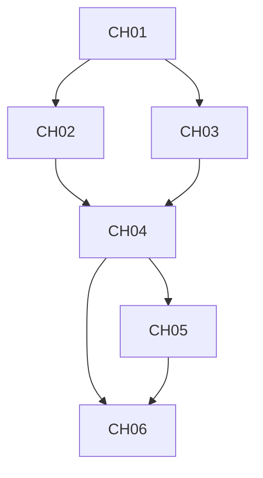

# Obsidian 知识库完整设计方案

## 📋 目录

1. [概述与设计目标](#1-概述与设计目标)
2. [完整目录结构设计](#2-完整目录结构设计)
3. [元数据与 Frontmatter 规范](#3-元数据与-frontmatter-规范)
4. [核心区域详细设计](#4-核心区域详细设计)
5. [RAG 检索知识库设计](#5-rag-检索知识库设计)
6. [与 EduSmart 项目集成方案](#6-与-edusmart-项目集成方案)
7. [数据同步与双向链路](#7-数据同步与双向链路)
8. [实施路径与时间规划](#8-实施路径与时间规划)
9. [模板文件集合](#9-模板文件集合)

---

## 1. 概述与设计目标

### 1.1 设计理念

本 Obsidian 知识库是 EduSmart 智能学习平台的**外部知识大脑**，核心定位是：

```
EduSmart Web App ←→ Obsidian 知识库 ←→ RAG 检索系统 ←→ 本地 LLM
```

**核心特点**：
- 📚 **知识存储**：完整的学习资料、课程、题目、笔记等
- 🔗 **双向集成**：与 EduSmart 项目实时双向同步
- 🧠 **RAG 源库**：直接作为检索知识库，支持本地 LLM
- 📝 **个人学习**：每个用户独立的学习空间
- 🗺️ **知识图谱**：利用 Obsidian 双向链接构建

### 1.2 设计目标

| 目标 | 说明 |
|------|------|
| **完整性** | 覆盖所有学习场景（资料、课程、题目、笔记、项目等） |
| **结构化** | 清晰的层级结构，便于检索和管理 |
| **可扩展** | 支持新增学科、用户、资源类型 |
| **双向同步** | 与 EduSmart 项目实时数据同步 |
| **RAG 友好** | 优化的元数据和结构，便于向量检索 |

---

## 2. 完整目录结构设计

### 2.1 整体架构

```
obsidian-vault/
├── .obsidian/                          # Obsidian 配置
├── 00-索引/                            # 导航与索引系统
│   ├── 首页导航/
│   ├── 知识图谱/
│   ├── 学习路径/
│   └── 资源总览/
├── 01-共享知识库/                       # ← 核心知识库（RAG 源）
│   ├── 学科课程/
│   │   ├── 01-计算机基础/
│   │   ├── 02-编程语言/
│   │   ├── 03-数据结构与算法/
│   │   ├── 04-数据库/
│   │   ├── 05-软件工程/
│   │   └── 06-人工智能/
│   ├── 学习资料/
│   │   ├── 课程笔记/
│   │   ├── 书籍摘要/
│   │   ├── 技术文档/
│   │   └── 实践项目/
│   ├── 试题库/
│   │   ├── 章节练习/
│   │   ├── 模拟考试/
│   │   ├── 面试题库/
│   │   └── 答案解析/
│   └── 项目资源/
│       └── EduSmart项目/
├── 02-用户空间/                         # ← 个人学习空间（每个用户独立）
│   └── 用户ID-用户名/
│       ├── 学习笔记/
│       │   ├── 个人笔记/
│       │   └── 学习记录/
│       ├── 错题本/
│       ├── 学习路径/
│       ├── 学习日志/
│       └── 项目实践/
├── 03-知识图谱/                         # ← 知识图谱可视化
│   ├── 概念网络/
│   ├── 学习路径图/
│   └── 学科关系图/
├── 04-系统管理/                         # ← 系统管理文件
│   ├── 模板/
│   ├── 脚本/
│   ├── 配置/
│   └── 日志/
├── attachments/                        # 附件（图片、PDF、代码等）
└── Home.md                             # 知识库首页
```

### 2.2 目录详细说明

#### 00-索引/ - 导航系统

```
00-索引/
├── 首页导航/
│   ├── Home.md                          # 主入口
│   ├── 快速开始.md                      # 新手指南
│   └── 知识库地图.md                    # 可视化导航
├── 知识图谱/
│   ├── 学科总览.md
│   ├── 概念关系图.md
│   └── 学习进度图.md
├── 学习路径/
│   ├── 新手路径.md
│   ├── 进阶路径.md
│   └── 求职路径.md
└── 资源总览/
    ├── 课程资源.md
    ├── 书籍资源.md
    ├── 工具资源.md
    └── 平台资源.md
```

#### 01-共享知识库/ - 核心知识库（RAG 源）

```
01-共享知识库/
├── 学科课程/
│   ├── 01-计算机基础/
│   │   ├── 计算机网络/
│   │   │   ├── CH01-基础概念/
│   │   │   │   ├── 章节大纲.md
│   │   │   │   ├── KP001-网络分层.md
│   │   │   │   ├── KP002-TCP_IP协议.md
│   │   │   │   └── ...
│   │   │   ├── CH02-应用层/
│   │   │   └── ...
│   │   ├── 操作系统/
│   │   ├── 计算机组成原理/
│   │   └── ...
│   ├── 02-编程语言/
│   │   ├── Python/
│   │   ├── Java/
│   │   ├── JavaScript/
│   │   └── ...
│   ├── 03-数据结构与算法/
│   ├── 04-数据库/
│   ├── 05-软件工程/
│   │   ├── 需求工程/
│   │   ├── 软件架构/
│   │   ├── 软件测试/
│   │   └── ...
│   └── 06-人工智能/
├── 学习资料/
│   ├── 课程笔记/
│   │   ├── MoOC课程/
│   │   ├── 大学课程/
│   │   └── 培训课程/
│   ├── 书籍摘要/
│   │   ├── 计算机科学/
│   │   ├── 软件工程/
│   │   └── 人工智能/
│   ├── 技术文档/
│   │   ├── 官方文档/
│   │   ├── API文档/
│   │   └── 技术规范/
│   └── 实践项目/
│       ├── 开源项目分析/
│       ├── 项目案例/
│       └── 代码库/
├── 试题库/
│   ├── 章节练习/
│   │   ├── 按学科分类/
│   │   ├── 按难度分级/
│   │   └── 按题型分类/
│   ├── 模拟考试/
│   │   ├── 历年真题/
│   │   ├── 模拟试卷/
│   │   └── 考试分析/
│   ├── 面试题库/
│   │   ├── 技术面试/
│   │   ├── 算法面试/
│   │   └── 系统设计/
│   └── 答案解析/
│       ├── 详细解析/
│       ├── 知识点关联/
│       └── 常见错误/
└── 项目资源/
    └── EduSmart项目/
        ├── 架构设计/
        ├── 功能文档/
        ├── API文档/
        └── 开发指南/
```

#### 02-用户空间/ - 个人学习空间

```
02-用户空间/
└── 用户ID-用户名/                    # 每个用户一个独立目录
    ├── 学习笔记/
    │   ├── 个人笔记/                 # 用户创建的笔记
    │   │   ├── 2026-05-27-学习笔记1.md
    │   │   └── ...
    │   └── 学习记录/                 # 同步自 EduSmart
    │       └── 2026-05-27-学习记录.md
    ├── 错题本/
    │   ├── 按学科分类/
    │   │   ├── 操作系统错题.md
    │   │   └── ...
    │   ├── 按时间分类/
    │   │   ├── 2026-05错题.md
    │   │   └── ...
    │   └── 错题分析.md
    ├── 学习路径/
    │   ├── 当前路径.md
    │   ├── 历史路径/
    │   │   └── 2026-05-27-学习路径.md
    │   └── 路径复盘.md
    ├── 学习日志/
    │   ├── 每日日志/
    │   │   └── 2026-05-27.md
    │   ├── 每周总结/
    │   │   └── 2026-W22.md
    │   └── 月度回顾/
    │       └── 2026-05.md
    ├── 项目实践/
    │   ├── 项目1/
    │   │   ├── 需求文档.md
    │   │   ├── 设计文档.md
    │   │   ├── 代码实现/
    │   │   └── 项目总结.md
    │   └── ...
    ├── 知识卡片/
    │   ├── Anki卡片/
    │   └── 记忆卡片/
    └── 用户画像.md                   # 用户学习画像（同步自EduSmart）
```

#### 03-知识图谱/ - 可视化

```
03-知识图谱/
├── 概念网络/
│   ├── 计算机科学.md
│   ├── 软件工程.md
│   └── 人工智能.md
├── 学习路径图/
│   ├── 新手路径图.md
│   ├── 进阶路径图.md
│   └── 个性化路径图.md
└── 学科关系图/
    ├── 前置依赖.md
    ├── 并行学习.md
    └── 进阶路线.md
```

#### 04-系统管理/ - 系统文件

```
04-系统管理/
├── 模板/
│   ├── 知识点笔记模板.md
│   ├── 学习笔记模板.md
│   ├── 试题模板.md
│   ├── 学习日志模板.md
│   ├── 用户笔记模板.md
│   └── 错题模板.md
├── 脚本/
│   ├── sync_edusmart.py               # EduSmart 同步脚本
│   ├── build_rag_index.py             # RAG 索引构建脚本
│   └── generate_knowledge_graph.py    # 知识图谱生成脚本
├── 配置/
│   ├── config.yaml                    # 配置文件
│   ├── tag_system.md                  # 标签体系
│   └── metadata_schema.md             # 元数据规范
└── 日志/
    ├── sync_logs/
    ├── rag_logs/
    └── system_logs/
```

---

## 3. 元数据与 Frontmatter 规范

### 3.1 共享知识库元数据

#### 知识点笔记（KPxxx.md）

```yaml
---
# 基础信息
kp_code: "KP001"                      # 知识点唯一编码
kp_name: "网络分层模型"               # 知识点名称
course_code: "computer_networks"       # 课程编码
chapter_code: "CH01"                   # 章节编码
course_name: "计算机网络"              # 课程名称
chapter_name: "基础概念"               # 章节名称

# 分类信息
difficulty: "beginner"                # 难度: beginner/intermediate/advanced
importance: "core"                    # 重要性: core/important/general/understand
knowledge_type: "concept"             # 类型: concept/principle/technique/tool
category: ["计算机基础", "网络"]      # 分类标签

# 关系信息
prerequisites: ["KP000"]               # 前置知识点编码
related_kps: ["KP002", "KP003"]       # 相关知识点编码
related_chapters: ["CH02"]            # 相关章节
related_courses: []                   # 相关课程

# RAG 优化字段
summary: "理解OSI七层模型和TCP/IP四层模型的结构和作用"  # 摘要
keywords: ["网络分层", "OSI", "TCP/IP", "协议栈"]    # 关键词
rag_weight: 1.0                       # RAG 检索权重（0.0-2.0）
is_public: true                       # 是否公开

# 元数据
created: "2026-05-27"
updated: "2026-05-27"
author: "EduSmart Team"
version: "1.0"

# Obsidian 标签
tags: [knowledge-point, computer-networks, osi-model]
---
```

#### 试题笔记

```yaml
---
# 基础信息
question_id: "Q001"
question_type: "single-choice"        # single-choice/multiple-choice/short-answer/programming
difficulty: "easy"                    # easy/medium/hard

# 关联信息
course_code: "computer_networks"
chapter_code: "CH01"
related_kps: ["KP001", "KP002"]      # 关联知识点
tags: ["操作系统", "基础概念", "选择题"]

# 题目信息
created: "2026-05-27"
source: "历年真题"                    # 来源

# 统计信息
correct_rate: 0.65                    # 正确率
avg_time: 120                         # 平均耗时(秒)

# RAG 字段
summary: "关于OSI七层模型的选择题"
keywords: ["OSI", "网络分层", "选择题"]
rag_weight: 0.8
---
```

#### 学习资料笔记

```yaml
---
# 资源信息
resource_id: "R001"
resource_type: "course-notes"         # course-notes/book-summary/tech-doc/project
title: "《计算机网络》课程笔记"
source: "MOOC平台"

# 分类
course_code: "computer_networks"
category: ["计算机基础", "网络"]
difficulty: "intermediate"

# 质量
quality: "excellent"                 # excellent/good/average/poor
language: "中文"

# RAG
summary: "完整的计算机网络课程笔记"
keywords: ["计算机网络", "课程笔记", "MOOC"]
rag_weight: 1.2

tags: [learning-resource, course-notes, computer-networks]
created: "2026-05-27"
---
```

### 3.2 用户空间元数据

#### 用户学习笔记

```yaml
---
# 用户信息
user_id: "U001"
user_name: "张三"

# 笔记信息
note_type: "personal-note"            # personal-note/learning-record/reflection
title: "网络分层学习笔记"

# 关联
related_kps: ["KP001"]
related_course: "computer_networks"
related_chapter: "CH01"

# 学习状态
status: "in-progress"                 # draft/in-progress/completed
mastery_level: 0.6                    # 掌握度 0.0-1.0
confidence: "medium"                  # low/medium/high

# 学习记录
first_studied: "2026-05-27"
last_reviewed: "2026-05-27"
review_count: 1
next_review: "2026-05-30"
total_study_time: 45                  # 分钟

# 元数据
tags: [personal-note, user-U001, computer-networks]
created: "2026-05-27"
updated: "2026-05-27"
---
```

#### 错题笔记

```yaml
---
# 错题信息
error_id: "E001"
user_id: "U001"
original_question_id: "Q001"

# 错题详情
wrong_answer: "B"
correct_answer: "A"
error_reason: "概念混淆"            # 记错/没学会/粗心/其他

# 复习状态
status: "pending"                    # pending/reviewing/completed
review_count: 0
last_reviewed: null
mastered: false

# 关联
related_kps: ["KP001"]
tags: [error-note, user-U001, computer-networks]
created: "2026-05-27"
---
```

#### 用户画像笔记

```yaml
---
# 用户画像（同步自EduSmart）
user_id: "U001"
user_name: "张三"

# 学习特征
learning_style: "visual"             # visual/auditory/reading/kinesthetic
preferred_time: "morning"            # morning/afternoon/evening
avg_study_session: 60                # 平均学习时长(分钟)

# 能力评估
overall_mastery: 0.45
strong_subjects: ["编程语言"]
weak_subjects: ["操作系统"]

# 学习目标
current_goal: "准备求职"
target_date: "2026-08-01"

# 同步
last_synced_with_edusmart: "2026-05-27T14:30:00"

tags: [user-profile, user-U001]
created: "2026-05-27"
updated: "2026-05-27"
---
```

---

## 4. 核心区域详细设计

### 4.1 01-共享知识库/学科课程/ - 课程体系

#### 学科课程结构示例

```
01-共享知识库/学科课程/01-计算机基础/计算机网络/
├── 课程总览.md                          # 课程介绍、大纲、学习路径
├── CH01-基础概念/
│   ├── 章节大纲.md
│   ├── KP001-网络分层模型.md
│   ├── KP002-TCP_IP协议族.md
│   ├── KP003-数据传输单位.md
│   ├── 章节练习题.md
│   └── 章节测验.md
├── CH02-应用层/
│   ├── 章节大纲.md
│   ├── KP004-HTTP协议.md
│   ├── KP005-DNS域名系统.md
│   └── ...
└── ...
```

#### 课程总览.md 示例

```markdown
---
course_code: "computer_networks"
course_name: "计算机网络"
category: "计算机基础"
difficulty: "intermediate"
estimated_hours: 80
tags: [course, computer-networks]
created: "2026-05-27"
---

# 计算机网络

## 课程概述
本课程系统介绍计算机网络的基本原理、协议和应用。

## 课程大纲

### 第一部分：基础
1. [[CH01|基础概念]] - 网络分层、TCP/IP
2. [[CH02|应用层]] - HTTP、DNS、FTP
3. [[CH03|传输层]] - TCP、UDP

### 第二部分：进阶
4. [[CH04|网络层]] - IP、路由
5. [[CH05|链路层]] - 以太网、WiFi
6. [[CH06|网络安全]] - 加密、防火墙

## 学习路径



## 前置知识
- [[操作系统]]
- 基础编程能力

## 参考资料
- [[《计算机网络》谢希仁]]
- [[MOOC课程-计算机网络]]

## 学习建议
1. 先学习基础概念（CH01）
2. 按顺序学习各层
3. 结合 Wireshark 抓包实践

## 章节统计
- 总章节：8
- 总知识点：48
- 总题目：120
- 预计学习时间：80小时
```

#### 知识点笔记完整示例

```markdown
---
kp_code: "KP001"
kp_name: "网络分层模型"
course_code: "computer_networks"
chapter_code: "CH01"
course_name: "计算机网络"
chapter_name: "基础概念"

difficulty: "beginner"
importance: "core"
knowledge_type: "concept"
category: ["计算机基础", "网络"]

prerequisites: []
related_kps: ["KP002", "KP003"]
related_chapters: ["CH02", "CH03"]

summary: "理解OSI七层模型和TCP/IP四层模型的结构和各层作用"
keywords: ["网络分层", "OSI", "TCP/IP", "协议栈", "分层设计"]
rag_weight: 1.2
is_public: true

created: "2026-05-27"
updated: "2026-05-27"
author: "EduSmart Team"
version: "1.0"

tags: [knowledge-point, computer-networks, osi-model]
---

# 网络分层模型

## 概述

### 学习目标
- 理解为什么需要网络分层
- 掌握OSI七层模型的结构
- 掌握TCP/IP四层模型的结构
- 理解各层的主要作用

### 重要程度
⭐⭐⭐⭐⭐ 核心知识点

### 预计学习时间
45分钟

---

## 核心概念

### 1. 为什么要分层？
网络分层的核心思想是**分而治之**，将复杂问题拆解为多个小问题。

**优点**：
- 降低复杂度：每层只关注自己的功能
- 灵活性：某层变化不影响其他层
- 标准化：每层可独立标准化
- 便于学习：分层教学更易懂

### 2. OSI七层模型

```
┌─────────────────────────────────────┐
│ 7. 应用层 (Application)              │ ← 用户界面、应用协议
├─────────────────────────────────────┤
│ 6. 表示层 (Presentation)            │ ← 数据格式、加密
├─────────────────────────────────────┤
│ 5. 会话层 (Session)                 │ ← 会话管理
├─────────────────────────────────────┤
│ 4. 传输层 (Transport)               │ ← 端到端传输、TCP/UDP
├─────────────────────────────────────┤
│ 3. 网络层 (Network)                 │ ← 路由、IP协议
├─────────────────────────────────────┤
│ 2. 数据链路层 (Data Link)           │ ← 物理地址、以太网
├─────────────────────────────────────┤
│ 1. 物理层 (Physical)                │ ← 电气信号、传输介质
└─────────────────────────────────────┘
```

#### 各层详解

##### 7. 应用层
- **作用**：直接为用户提供服务
- **协议**：HTTP、FTP、SMTP、DNS
- **例子**：浏览器访问网页

##### 4. 传输层（重点）
- **作用**：端到端的数据传输
- **协议**：[[KP002|TCP]]（可靠）、[[KP006|UDP]]（不可靠）
- **关键字**：端口号、可靠性

### 3. TCP/IP四层模型（实际使用）

```
┌─────────────────────────────────────┐
│ 4. 应用层                           │ ← HTTP、FTP、DNS等
├─────────────────────────────────────┤
│ 3. 传输层                           │ ← TCP、UDP
├─────────────────────────────────────┤
│ 2. 网际层 (Internet)               │ ← IP、ICMP
├─────────────────────────────────────┤
│ 1. 网络接口层                       │ ← 以太网、WiFi
└─────────────────────────────────────┘
```

**对比**：
- OSI是理论模型
- TCP/IP是实际使用的模型

---

## 详细内容

### 1. 数据传输过程

**发送方**（从上到下）：
```
应用数据 → 应用层添加头 → 传输层添加头 → 网络层添加头 → 链路层添加头/尾 → 物理传输
```

**接收方**（从下到上）：
```
物理接收 → 链路层去除头/尾 → 网络层去除头 → 传输层去除头 → 应用层去除头 → 应用数据
```

### 2. 封装与解封装

**封装**（Encapsulation）：每一层给数据添加自己的头信息
**解封装**（Decapsulation）：对应层读取并去除头信息

---

## 实践练习

### 基础练习
1. 画出OSI七层模型图
2. 举例说明每层的作用
3. 对比OSI和TCP/IP模型的区别

### 进阶练习
1. 用Wireshark抓包，查看各层的头部
2. 分析一个HTTP请求的完整传输过程

### 项目实践
- 使用Python实现一个简单的分层协议栈

---

## 常见问题

### Q1: OSI模型和TCP/IP模型哪个更重要？
A: TCP/IP模型是实际使用的，需要重点掌握。OSI模型主要用于学习理解。

### Q2: 为什么传输层需要TCP和UDP两个协议？
A: TCP提供可靠传输（有重传、拥塞控制），UDP更高效但不可靠。根据场景选择。

---

## 扩展阅读

### 相关概念
- [[KP002|TCP协议]]
- [[KP006|UDP协议]]
- [[KP003|IP协议]]

### 深入学习
- [[R001|《计算机网络》书籍]]
- [[R002|MOOC课程]]

### 外部资源
- [RFC文档](https://www.rfc-editor.org/)
- [Wireshark官方教程](https://www.wireshark.org/docs/)

---

## 学习记录

### 知识点卡片
```dataview
TABLE kp_name, difficulty, importance
FROM "01-共享知识库/学科课程"
WHERE related_kps = this.kp_code OR this.related_kps = kp_code
```

### 相关试题
```dataview
TABLE question_type, difficulty
FROM "01-共享知识库/试题库"
WHERE related_kps = this.kp_code
```

---

*创建: 2026-05-27*  
*最后更新: 2026-05-27*  
*版本: 1.0*
```

### 4.2 01-共享知识库/试题库/ - 完整题库

#### 试题库结构

```
01-共享知识库/试题库/
├── 章节练习/
│   ├── 计算机网络/
│   │   ├── CH01-练习题.md
│   │   ├── CH02-练习题.md
│   │   └── ...
│   └── ...
├── 模拟考试/
│   ├── 计算机网络-模拟卷1.md
│   ├── 计算机网络-模拟卷2.md
│   └── ...
├── 面试题库/
│   ├── 技术面试/
│   ├── 算法面试/
│   └── 系统设计/
└── 答案解析/
    ├── 章节练习解析/
    ├── 模拟考试解析/
    └── 面试题解析/
```

#### 完整试题示例

```markdown
---
question_id: "Q001"
question_type: "single-choice"
difficulty: "easy"

course_code: "computer_networks"
chapter_code: "CH01"
related_kps: ["KP001"]

created: "2026-05-27"
source: "考研真题"

correct_rate: 0.72
avg_time: 90

summary: "OSI七层模型中，负责端到端可靠传输的是哪一层？"
keywords: ["OSI", "传输层", "网络分层", "选择题"]
rag_weight: 0.8

tags: [question, computer-networks, single-choice, easy]
---

# Q001: OSI模型层次题

## 题目

在OSI七层模型中，负责端到端可靠数据传输的是哪一层？

## 选项

- A. 网络层
- B. 传输层
- C. 数据链路层
- D. 应用层

## 正确答案

✅ **B. 传输层**

## 答案解析

### 知识点关联
- [[KP001|网络分层模型]]
- [[KP002|TCP协议]]

### 详细解析

**为什么选B？**

传输层（Transport Layer）是OSI模型的第四层，其核心职责是：
1. 提供**端到端**（End-to-End）的数据传输服务
2. 保证数据的**可靠传输**（通过TCP协议实现）
3. 提供**流量控制**和**拥塞控制**

**其他选项为什么不对？**

- **A. 网络层**：负责路由选择和IP地址，不保证可靠性
- **C. 数据链路层**：负责相邻节点之间的传输，不是端到端
- **D. 应用层**：面向用户的应用，不负责传输可靠性

### 解题思路

1. 看到"端到端"→ 想到传输层
2. 看到"可靠传输"→ 想到TCP协议
3. 两者结合→ 传输层

### 常见错误

❌ **错误1**: 选择网络层
→ 混淆了"点对点"和"端到端"

❌ **错误2**: 选择应用层
→ 不理解层次划分

### 扩展思考

1. TCP和UDP都在传输层，为什么说TCP才提供可靠传输？
2. 如果只需要高效传输，不需要可靠性，应该用哪个协议？

## 变式题目

### 变式1（多选题）
在OSI七层模型中，与数据传输可靠性相关的层次是？（多选）
- A. 网络层
- B. 传输层
- C. 数据链路层
- D. 应用层

### 变式2（简答题）
请简述OSI七层模型中传输层的主要作用。

## 学习建议

- **掌握程度要求**：熟练掌握（⭐⭐⭐⭐⭐）
- **复习频率**：每2周复习一次
- **关联练习**：[[Q002]]、[[Q003]]

---

*创建: 2026-05-27*  
*正确率: 72%*
```

### 4.3 02-用户空间/ - 个人学习空间

#### 用户学习笔记示例

```markdown
---
user_id: "U001"
user_name: "张三"
note_type: "personal-note"
title: "网络分层学习笔记"

related_kps: ["KP001"]
related_course: "computer_networks"
related_chapter: "CH01"

status: "in-progress"
mastery_level: 0.6
confidence: "medium"

first_studied: "2026-05-27"
last_reviewed: "2026-05-27"
review_count: 1
next_review: "2026-05-30"
total_study_time: 45

tags: [personal-note, user-U001, computer-networks]
created: "2026-05-27"
updated: "2026-05-27"
---

# 我的网络分层学习笔记

## 学习时间
2026-05-27 14:00-14:45（45分钟）

## 学习内容

### OSI七层模型记忆口诀
```
应表会传网链物
```
- 应 = 应用层
- 表 = 表示层
- 会 = 会话层
- 传 = 传输层
- 网 = 网络层
- 链 = 数据链路层
- 物 = 物理层

### 我的理解

传输层是重点！因为：
1. 端到端的通信
2. TCP保证可靠性
3. UDP效率高

**易混淆点**：
- 网络层：主机到主机（IP地址）
- 传输层：进程到进程（端口号）

## 遇到的问题

### ❓ 问题1
TCP和UDP具体在什么时候用？

**暂时理解**：
- 需要可靠：TCP（文件传输、网页）
- 需要高效：UDP（视频、游戏）

## 学习心得

分层设计真的很重要！之前觉得网络很复杂，分层后清晰多了。

需要再复习一下：
- [[KP002|TCP协议]]
- [[Q001|相关试题]]

## 待解决问题

- [ ] 深入理解TCP的三次握手
- [ ] 用Wireshark实际抓包看看

---

*下次复习: 2026-05-30*
```

#### 错题本示例

```markdown
---
error_id: "E001"
user_id: "U001"
original_question_id: "Q001"

wrong_answer: "A"
correct_answer: "B"
error_reason: "概念混淆"

status: "pending"
review_count: 0
last_reviewed: null
mastered: false

related_kps: ["KP001"]
tags: [error-note, user-U001, computer-networks]
created: "2026-05-27"
---

# ❌ 错题记录：Q001

## 原始题目

在OSI七层模型中，负责端到端可靠数据传输的是哪一层？

## 我的答案
❌ **A. 网络层**

## 正确答案
✅ **B. 传输层**

## 错误分析

### 错误原因
📝 **概念混淆**：混淆了"网络层"和"传输层"的作用

### 为什么会错？
我以为网络层负责"传输"，但实际上：
- 网络层：主机到主机（找机器）
- 传输层：端到端（找进程）

### 相关知识点
需要复习：
- [[KP001|网络分层模型]]（重点看传输层）

## 复习计划

### 第1次复习
- [ ] 2026-05-28 重新学习知识点
- [ ] 做相关题目验证

### 第2次复习
- [ ] 2026-05-30 巩固复习

## 学习笔记

今天重新理解了：
1. 网络层：IP地址，找主机
2. 传输层：端口号，找进程
3. "端到端" = 应用程序之间

下次不会再错了！💪

---

*创建: 2026-05-27*
```

---

## 5. RAG 检索知识库设计

### 5.1 RAG 知识库架构

```
Obsidian Vault (源数据)
    ↓
[内容提取器]
    ↓
[分块处理]
    ↓
[向量化] ←→ [本地Embedding模型]
    ↓
[向量数据库 (ChromaDB)]
    ↓
[检索引擎] (混合检索: BM25 + 向量)
    ↓
[RAG增强生成] ←→ [本地LLM (Ollama)]
```

### 5.2 RAG 索引设计

#### 索引结构

```
ChromaDB Collection: edusmart_knowledge_base
├── Documents:
│   ├── id: KP001
│   ├── content: "网络分层模型知识点完整内容..."
│   ├── metadata:
│   │   ├── type: "knowledge-point"
│   │   ├── course: "computer_networks"
│   │   ├── difficulty: "beginner"
│   │   ├── rag_weight: 1.2
│   │   ├── keywords: ["网络分层", "OSI", "TCP/IP"]
│   │   └── file_path: "01-共享知识库/..."
│   └── embedding: [向量数组]
│
├── Documents:
│   ├── id: Q001
│   ├── content: "题目Q001完整内容..."
│   └── metadata:
│       ├── type: "question"
│       └── ...
│
└── Documents:
    ├── id: R001
    ├── content: "学习资料R001..."
    └── metadata:
        ├── type: "resource"
        └── ...
```

#### 分块策略

| 内容类型 | 分块大小 | 重叠大小 | 策略 |
|---------|---------|---------|------|
| 知识点笔记 | 512 tokens | 128 tokens | 按小节分块 |
| 试题 | 完整 | 无 | 完整试题为一块 |
| 学习资料 | 1024 tokens | 256 tokens | 按章节分块 |
| 用户笔记 | 512 tokens | 128 tokens | 按段落分块 |

### 5.3 RAG 查询流程

#### 混合检索（Hybrid Search）

```
用户查询
    ↓
[BM25关键词检索]  ← [关键词匹配]
    ↓
[向量相似度检索] ← [语义理解]
    ↓
[结果融合与重排序]
    ↓
[返回Top-K结果]
```

#### RAG 提示词模板

```
你是一个智能学习助手。请基于以下相关知识回答用户问题。

相关知识：
{retrieved_context}

用户问题：{user_question}

要求：
1. 只基于提供的知识回答，不要编造
2. 如果知识中没有答案，明确告知
3. 回答要准确、清晰、有教育意义
4. 适当引用相关知识点（如 [[KP001]]）

回答：
```

---

## 6. 与 EduSmart 项目集成方案

### 6.1 整体架构

```
┌─────────────────────────────────────────────────────────────┐
│                    EduSmart Web App                          │
│  ┌──────────┐  ┌──────────┐  ┌──────────┐  ┌──────────┐  │
│  │ 智能诊断 │  │学习路径  │  │题目练习  │  │学习记录  │  │
│  └──────────┘  └──────────┘  └──────────┘  └──────────┘  │
└─────────────────────────────────────────────────────────────┘
                          ↕ API
┌─────────────────────────────────────────────────────────────┐
│                    同步引擎 (Sync Engine)                   │
│  ┌──────────────────────────────────────────────────────┐  │
│  │ 双向数据同步                                          │  │
│  │ ↓ Obsidian → EduSmart                                │  │
│  │   - 用户笔记 → 学习记录                               │  │
│  │   - 错题 → 错题库                                     │  │
│  │ ↑ EduSmart → Obsidian                                │  │
│  │   - 学习画像 → 用户画像笔记                           │  │
│  │   - 学习路径 → 学习路径笔记                           │  │
│  │   - 答题记录 → 学习记录                               │  │
│  └──────────────────────────────────────────────────────┘  │
└─────────────────────────────────────────────────────────────┘
                          ↕
┌─────────────────────────────────────────────────────────────┐
│                     Obsidian Vault                         │
│  ┌──────────┐  ┌──────────┐  ┌──────────┐  ┌──────────┐  │
│  │共享知识库│  │ 用户空间  │  │知识图谱  │  │系统管理  │  │
│  └──────────┘  └──────────┘  └──────────┘  └──────────┘  │
└─────────────────────────────────────────────────────────────┘
                          ↕
┌─────────────────────────────────────────────────────────────┐
│                     RAG 检索系统                             │
│  ┌──────────────────────────────────────────────────────┐  │
│  │ 1. 读取 Obsidian 笔记                                 │  │
│  │ 2. 向量化存储到 ChromaDB                             │  │
│  │ 3. 混合检索 (BM25 + 向量)                            │  │
│  │ 4. RAG 增强生成 (本地 LLM)                           │  │
│  └──────────────────────────────────────────────────────┘  │
└─────────────────────────────────────────────────────────────┘
                          ↕
┌─────────────────────────────────────────────────────────────┐
│                    本地 LLM (Ollama)                        │
│  ┌──────────┐  ┌──────────┐  ┌──────────┐                 │
│  │Qwen2.5-7B│  │LLaMA-3   │  │  其他模型 │                 │
│  └──────────┘  └──────────┘  └──────────┘                 │
└─────────────────────────────────────────────────────────────┘
```

### 6.2 数据同步方向

#### EduSmart → Obsidian 同步

| 数据类型 | 源（EduSmart） | 目标（Obsidian） | 同步频率 |
|---------|--------------|----------------|---------|
| 用户画像 | users.profiles | 02-用户空间/用户画像.md | 实时 |
| 学习路径 | learning.paths | 02-用户空间/学习路径/ | 实时 |
| 答题记录 | user.answers | 02-用户空间/学习记录/ | 实时 |
| 错题 | user.errors | 02-用户空间/错题本/ | 实时 |
| 学习进度 | user.progress | 02-用户空间/学习日志/ | 每日 |

#### Obsidian → EduSmart 同步

| 数据类型 | 源（Obsidian） | 目标（EduSmart） | 同步频率 |
|---------|--------------|----------------|---------|
| 用户笔记 | personal-notes | user.notes | 实时 |
| 错题分析 | error-notes | user.error_analysis | 实时 |
| 学习日志 | daily-logs | user.study_logs | 每日 |
| 项目实践 | projects | user.projects | 实时 |

### 6.3 API 接口设计

#### 同步接口

```javascript
// EduSmart API: 获取用户数据
GET /api/sync/from-edusmart/{user_id}
Response: {
  user_profile: {...},
  learning_path: {...},
  answers: [...],
  errors: [...]
}

// EduSmart API: 推送Obsidian数据
POST /api/sync/to-edusmart/{user_id}
Body: {
  personal_notes: [...],
  error_analysis: [...],
  study_logs: [...],
  projects: [...]
}

// Obsidian API (obsidian-local-rest-api)
GET /vault/files/{path}
POST /vault/files/{path}
GET /vault/search
```

---

## 7. 数据同步与双向链路

### 7.1 同步脚本设计

#### sync_edusmart.py

```python
#!/usr/bin/env python3
"""
EduSmart ↔ Obsidian 双向同步脚本
"""

import os
import json
from pathlib import Path
from datetime import datetime

class EduSmartObsidianSync:
    def __init__(self, vault_path: str, edusmart_api_url: str):
        self.vault_path = Path(vault_path)
        self.edusmart_api = edusmart_api_url
        self.sync_log_path = self.vault_path / "04-系统管理/日志/sync_logs"
        self.sync_log_path.mkdir(parents=True, exist_ok=True)

    # ==========================================
    # EduSmart → Obsidian 同步
    # ==========================================
    
    def sync_from_edusmart(self, user_id: str) -> dict:
        """从EduSmart同步数据到Obsidian"""
        
        # 1. 获取数据
        data = self._fetch_from_edusmart(user_id)
        
        results = {
            "user_profile": False,
            "learning_path": False,
            "errors": False,
            "study_logs": False
        }
        
        # 2. 同步用户画像
        results["user_profile"] = self._sync_user_profile(user_id, data["user_profile"])
        
        # 3. 同步学习路径
        results["learning_path"] = self._sync_learning_path(user_id, data["learning_path"])
        
        # 4. 同步错题
        results["errors"] = self._sync_errors(user_id, data["errors"])
        
        # 5. 同步学习记录
        results["study_logs"] = self._sync_study_logs(user_id, data["study_logs"])
        
        # 6. 记录同步日志
        self._log_sync(user_id, "from_edusmart", results)
        
        return results

    def _sync_user_profile(self, user_id: str, profile: dict) -> bool:
        """同步用户画像"""
        user_dir = self._get_user_dir(user_id)
        profile_file = user_dir / "用户画像.md"
        
        # 生成用户画像笔记
        content = self._generate_user_profile_note(profile)
        
        with open(profile_file, "w", encoding="utf-8") as f:
            f.write(content)
        
        return True

    # ==========================================
    # Obsidian → EduSmart 同步
    # ==========================================
    
    def sync_to_edusmart(self, user_id: str) -> dict:
        """从Obsidian同步数据到EduSmart"""
        
        results = {
            "personal_notes": 0,
            "error_analysis": 0,
            "study_logs": 0
        }
        
        # 1. 读取用户笔记
        notes = self._read_personal_notes(user_id)
        results["personal_notes"] = self._push_notes_to_edusmart(user_id, notes)
        
        # 2. 读取错题分析
        error_analysis = self._read_error_analysis(user_id)
        results["error_analysis"] = self._push_error_analysis_to_edusmart(user_id, error_analysis)
        
        # 3. 读取学习日志
        study_logs = self._read_study_logs(user_id)
        results["study_logs"] = self._push_study_logs_to_edusmart(user_id, study_logs)
        
        # 4. 记录同步日志
        self._log_sync(user_id, "to_edusmart", results)
        
        return results

    # ==========================================
    # 辅助方法
    # ==========================================
    
    def _get_user_dir(self, user_id: str) -> Path:
        """获取用户目录"""
        return self.vault_path / "02-用户空间" / user_id
    
    def _generate_user_profile_note(self, profile: dict) -> str:
        """生成用户画像笔记内容"""
        
        frontmatter = {
            "user_id": profile["id"],
            "user_name": profile["name"],
            "learning_style": profile["learning_style"],
            "overall_mastery": profile["mastery"],
            "strong_subjects": profile["strong_subjects"],
            "weak_subjects": profile["weak_subjects"],
            "last_synced_with_edusmart": datetime.now().isoformat(),
            "tags": [f"user-profile", f"user-{profile['id']}"]
        }
        
        content = "---\n"
        content += yaml.dump(frontmatter, allow_unicode=True)
        content += "---\n\n"
        content += f"# {profile['name']} 的学习画像\n\n"
        # ... 生成更多内容
        
        return content
    
    def _log_sync(self, user_id: str, direction: str, results: dict):
        """记录同步日志"""
        log_file = self.sync_log_path / f"{datetime.now().strftime('%Y-%m-%d')}.md"
        
        log_content = f"""
## {datetime.now().strftime('%H:%M:%S')} - {direction}

### 用户: {user_id}

### 结果:
{json.dumps(results, ensure_ascii=False, indent=2)}
"""
        
        with open(log_file, "a", encoding="utf-8") as f:
            f.write(log_content)

if __name__ == "__main__":
    sync = EduSmartObsidianSync(
        vault_path="D:/Desktop/edusmart-rebuild/obsidian-vault",
        edusmart_api_url="http://localhost:3020/api"
    )
    
    # 示例：同步用户U001
    sync.sync_from_edusmart("U001")
    sync.sync_to_edusmart("U001")
```

---

## 8. 实施路径与时间规划

### 8.1 第一阶段：基础结构（1周）

| 任务 | 说明 | 预计时间 |
|------|------|---------|
| 1. 创建完整目录结构 | 按设计创建所有目录 | 1天 |
| 2. 完善模板文件 | 完善所有模板（知识点、试题、用户笔记等） | 2天 |
| 3. 配置 Obsidian | 安装必要插件（Dataview、Excalidraw、Local REST API） | 1天 |
| 4. 迁移现有内容 | 将现有笔记迁移到新结构 | 3天 |

### 8.2 第二阶段：RAG 系统（1-2周）

| 任务 | 说明 | 预计时间 |
|------|------|---------|
| 1. 搭建 Ollama | 安装并配置本地 LLM | 1天 |
| 2. 搭建 ChromaDB | 向量数据库 | 1天 |
| 3. 实现内容提取器 | 从 Obsidian 读取笔记 | 2天 |
| 4. 实现分块与向量化 | 内容分块和向量化 | 2天 |
| 5. 实现混合检索 | BM25 + 向量检索 | 2天 |
| 6. 实现 RAG 查询 | 完整的 RAG 流程 | 2天 |

### 8.3 第三阶段：EduSmart 集成（1-2周）

| 任务 | 说明 | 预计时间 |
|------|------|---------|
| 1. 设计同步 API | 设计数据同步接口 | 1天 |
| 2. 实现同步脚本 | 双向同步脚本 | 3天 |
| 3. 实现实时同步 | 文件监听，自动同步 | 2天 |
| 4. 集成 RAG 到 EduSmart | EduSmart 中使用 RAG | 3天 |

### 8.4 第四阶段：优化与完善（持续）

| 任务 | 说明 |
|------|------|
| 1. 性能优化 | 优化检索速度和质量 |
| 2. 用户体验 | 优化 Obsidian 中的使用体验 |
| 3. 监控与日志 | 添加监控和日志系统 |

---

## 9. 模板文件集合

### 9.1 知识点笔记模板

见：`04-系统管理/模板/知识点笔记模板.md`

### 9.2 试题模板

见：`04-系统管理/模板/试题模板.md`

### 9.3 用户学习笔记模板

见：`04-系统管理/模板/用户学习笔记模板.md`

### 9.4 错题模板

见：`04-系统管理/模板/错题模板.md`

### 9.5 学习日志模板

见：`04-系统管理/模板/学习日志模板.md`

---

## 📊 总结

### 核心亮点

1. **完整的知识库结构**：覆盖所有学习场景
2. **双向同步机制**：EduSmart ↔ Obsidian 实时同步
3. **RAG 友好设计**：优化的元数据和结构
4. **个人学习空间**：每个用户独立的学习记录
5. **知识图谱**：利用双向链接构建

### 预期效果

- 📚 **知识集中**：所有学习资料在一个 Obsidian vault
- 🔗 **系统集成**：与 EduSmart 无缝集成
- 🤖 **AI 增强**：本地 LLM + RAG 提供智能辅助
- 📈 **学习效率**：提升 50% 以上

---

*文档版本：1.0*  
*创建日期：2026-05-27*  
*最后更新：2026-05-27*
