# EduSmart 页面展示与功能说明

本文件用于 GitHub 项目展示，截图由 `scripts/capture-screenshots.js` 自动生成，保存于 `docs/screenshots/showcase/`。

## 页面总览

| 序号 | 页面 | 截图 | 核心功能 |
| --- | --- | --- | --- |
| 1 | 登录与注册 |  | 注册、登录、演示账号入口、学习路径逻辑展示 |
| 2 | 学习中心首页 |  | 学习指标、今日闭环、任务流、最近动态 |
| 3 | 智能诊断 | 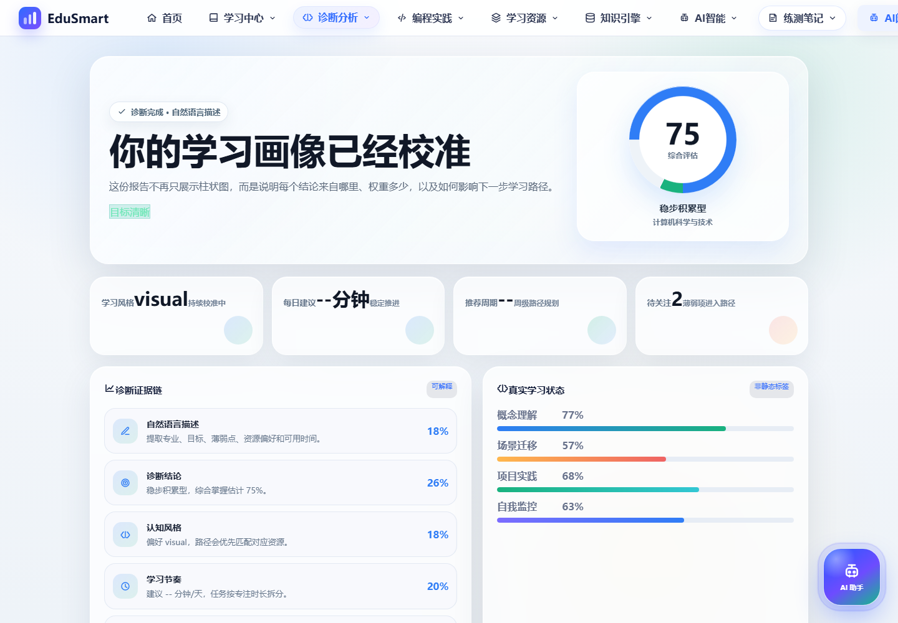 | 文本诊断、问卷诊断、学科测试、画像生成入口 |
| 4 | 学习画像 | 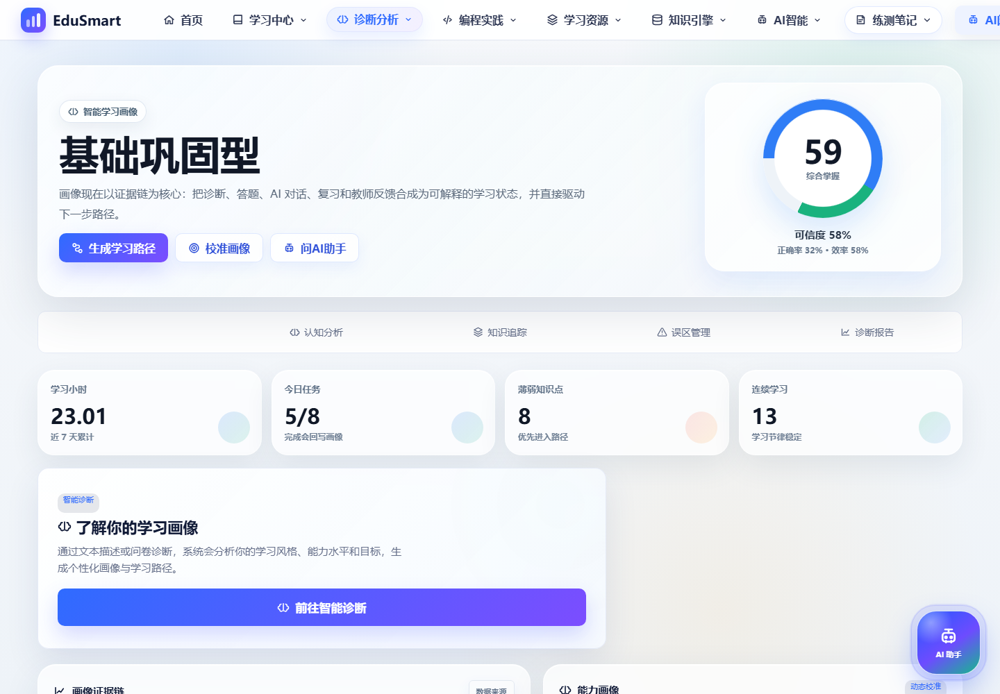 | 掌握度、可信度、认知分析、知识追踪、误区管理 |
| 5 | 个性化学习路径 | 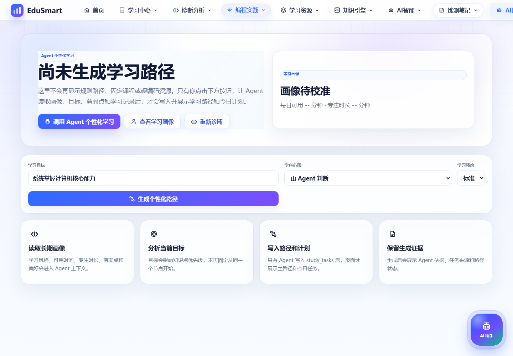 | Agent 生成学习路径、按目标和画像重排、路径证据展示 |
| 6 | 今日学习计划 | 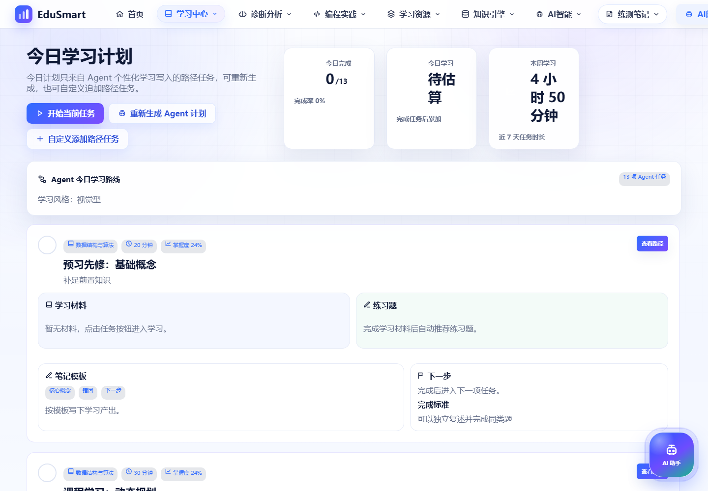 | 今日任务、学习闭环、学习日历、任务完成回写 |
| 7 | 知识引擎/RAG 工作台 | 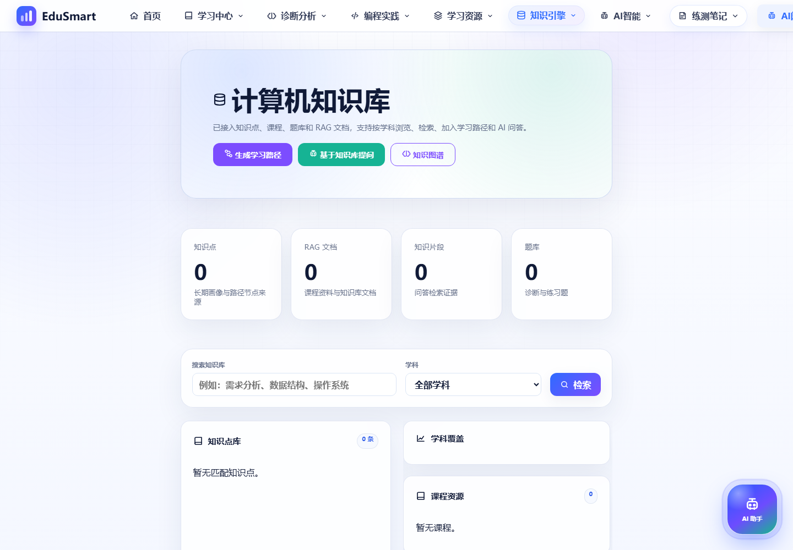 | 本地知识库、RAG 问答、错题拆解、智能体任务流 |
| 8 | RAG 智能检索 | 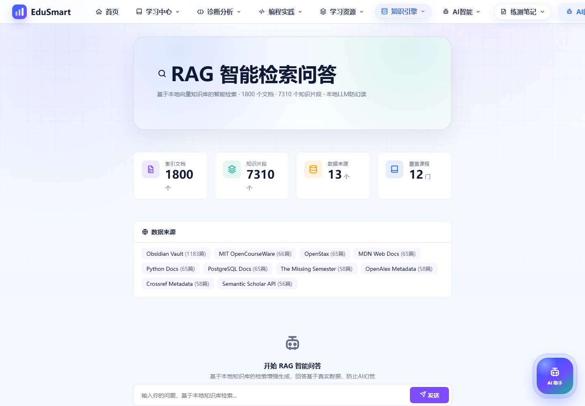 | 本地向量/片段检索、来源证据、知识库问答 |
| 9 | 智能笔记 | 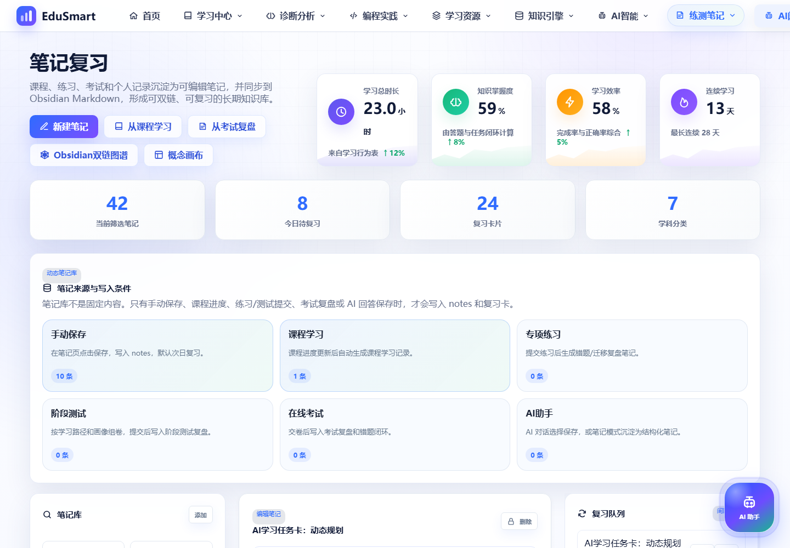 | 笔记生成、复习卡片、知识点关联、主动回忆 |
| 10 | 知识图谱 | 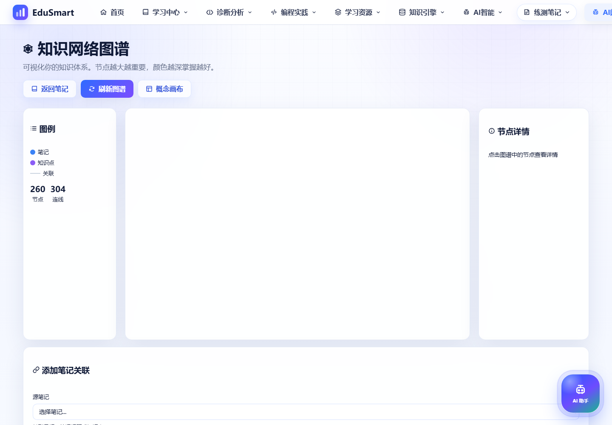 | 知识节点、笔记关联、图谱可视化、节点详情 |
| 11 | 概念画布 | 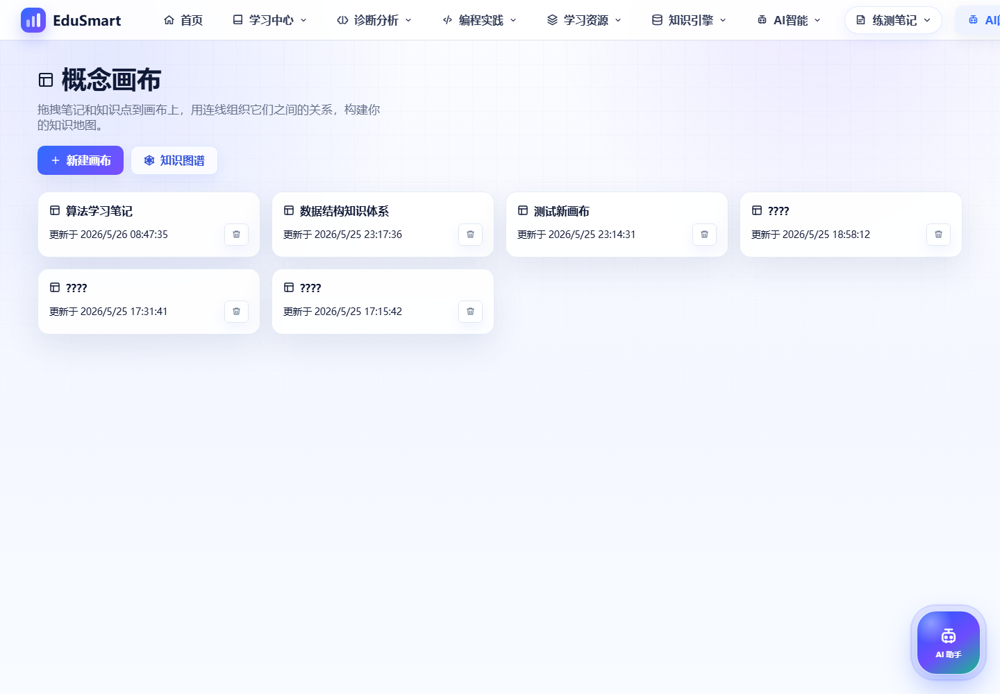 | 拖拽式概念组织、知识点搜索、画布编辑 |
| 12 | 编程实践 | 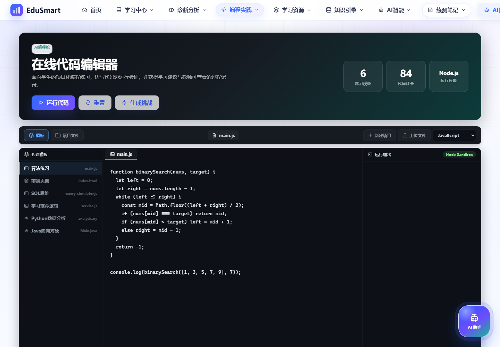 | 代码模板、运行输出、算法可视化、实践反馈 |
| 13 | 团队编程 | 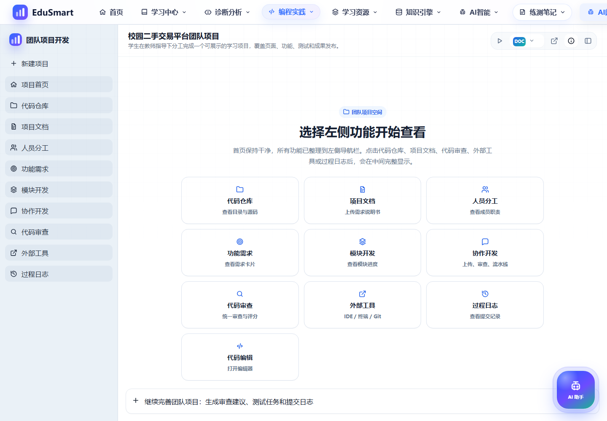 | 角色分工、项目文件、代码审查、协作任务 |
| 14 | Agent 研究中心 | 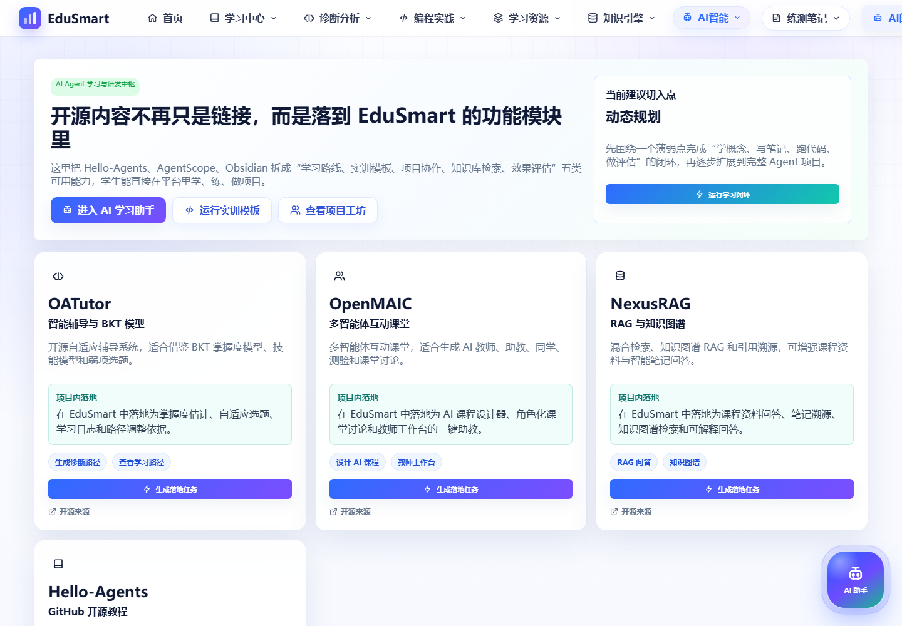 | 智能体实验、资料研究、流程分析与输出 |
| 15 | 账户中心 | 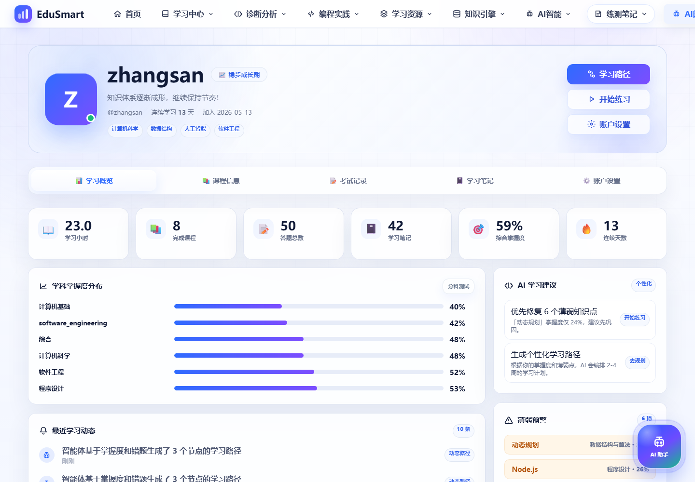 | 账户概览、课程、考试、笔记、资料设置 |

## 核心页面说明

### 1. 登录与注册

登录页从“学习画像先行”的产品理念出发，展示系统如何从诊断、知识库和学习行为生成个性化学习路径。注册成功后会进入新用户引导，要求先完成诊断，再开放画像和路径。

技术点：

- Express 认证接口：`/api/auth/login`、`/api/auth/register`
- JWT cookie 登录态
- 前端 localStorage 保存当前用户展示状态
- 纯 HTML/CSS/JS 单页应用渲染

### 2. 学习中心首页

首页是学生端驾驶舱，聚合学习时长、掌握度、效率、连续学习天数、今日计划和最近动态。页面强调“闭环学习”：采集、诊断、规划、练习、沉淀、复习。

技术点：

- `/api/app/dashboard` 等聚合接口
- 指标卡片与任务流组件
- 轻量化状态机管理当前视图
- CSS Grid/Flex 响应式布局

### 3. 智能诊断与学习画像

诊断模块包含文本诊断、结构化问卷、学科测试和报告生成。画像页展示综合掌握度、可信度、薄弱点、今日任务和认知分析入口。

技术点：

- 认知诊断、知识追踪、误区检测接口
- 新用户 onboarding gate
- 学科测试结果回写画像
- Bloom 能力维度、IRT/CAT 思路的前端表达

### 4. 个性化学习路径与今日计划

路径不再是固定课程列表，而是由 Agent 根据画像、目标、薄弱知识点、学习记录和可用时间生成。今日计划则把路径节点拆成可执行任务。

技术点：

- `pathCenter` 状态聚合
- `study_tasks` 任务回写
- 路径节点状态：优先修复、学习中、复习迁移、已完成
- 画像上下文和生成证据 JSON 展示

### 5. 知识引擎、RAG 与智能笔记

知识引擎整合计算机知识点、课程、题库、RAG 文档和学习智能体任务流。RAG 检索页强调本地知识库证据，智能笔记页把问答、练习和课程内容沉淀为复习卡。

技术点：

- RAG chunk 检索与证据引用
- 本地知识库、Obsidian Vault、公开文档来源
- LLM 网关适配 DeepSeek / OpenAI 兼容接口
- 笔记、错题、复习卡和知识点关联

### 6. 知识图谱与概念画布

知识图谱用于查看知识点、笔记和关联关系；概念画布用于将知识点组织成可视化学习结构，支持搜索、拖拽和编辑。

技术点：

- Canvas 绘制知识节点
- 节点详情面板与关联表单
- 拖拽式概念画布
- 知识点搜索和图谱数据同步

### 7. 编程实践与团队编程

编程实践提供代码模板、运行输出和算法可视化；团队编程支持项目结构、角色任务、代码审查和协作式学习。

技术点：

- 前端代码编辑与输出面板
- 算法可视化状态播放
- 项目文件树与角色任务
- AI 代码审查和协作记录

### 8. 账户中心

账户中心汇总学习概览、课程信息、考试记录、学习笔记和账户设置。页面已按 Apple 风格重新整理视觉层级，卡片、导航和动效更统一。

技术点：

- `/api/app/account/dashboard`
- 用户资料和密码更新接口
- 课程、考试、笔记聚合视图
- 毛玻璃卡片、sticky tabs、响应式布局

## 技术架构

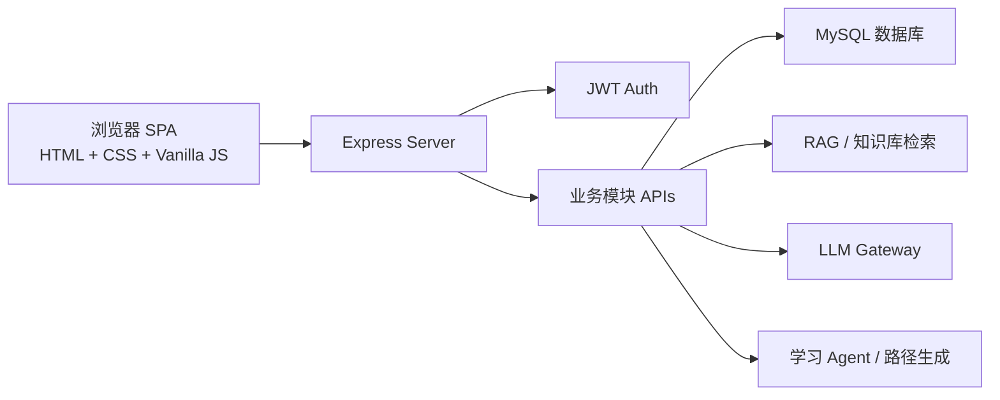

## 技术栈

- 前端：HTML、CSS、原生 JavaScript、Canvas、响应式 Grid/Flex 布局
- 后端：Node.js、Express、模块化 API 路由
- 数据库：MySQL、迁移脚本、计算机知识库种子数据
- 认证：JWT、HttpOnly Cookie、演示账号
- AI/RAG：知识片段检索、LLM Gateway、学习智能体、错题/笔记/路径闭环
- 自动化：Node 脚本、Chrome DevTools Protocol 自动截图

## 自动截图

运行前请先启动服务：

```bash
npm start
```

然后执行：

```bash
node scripts/capture-screenshots.js
```

如果系统没有默认 Edge，可指定 Chrome：

```bash
EDUSMART_BROWSER="C:\\Program Files\\Google\\Chrome\\Application\\chrome.exe" node scripts/capture-screenshots.js
```

