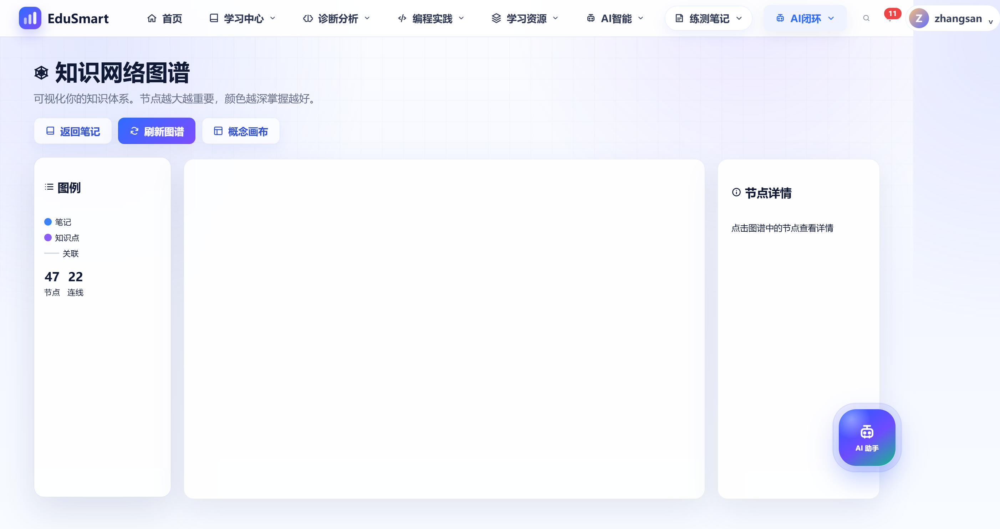
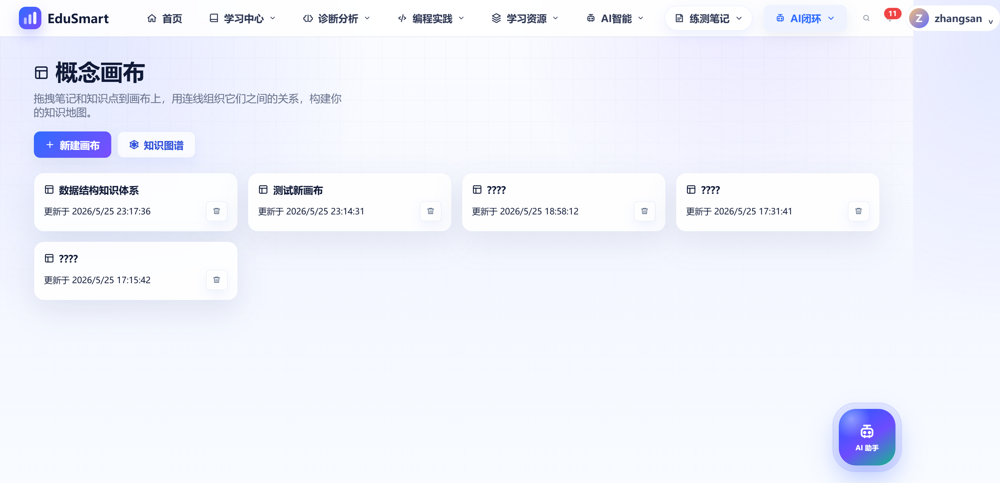
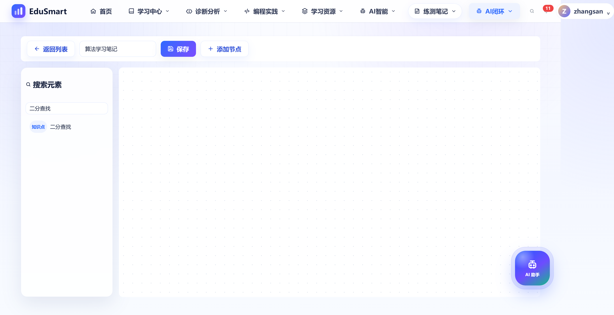
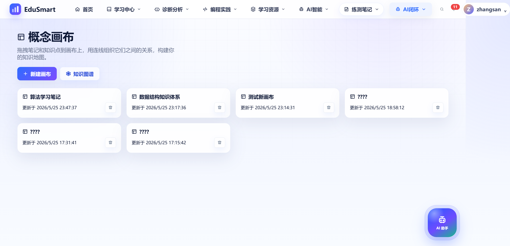

# EduSmart 知识图谱 & 概念画布 — 完整操作演示

> 演示日期：2026-05-25
> 测试环境：localhost:3020

---

## 快速操作步骤（5 分钟上手）

### 第一步：进入智能笔记页面

打开浏览器访问 `http://localhost:3020/smartNotes`，在页面顶部可以看到两个入口按钮：

- **知识图谱** 按钮
- **概念画布** 按钮


---

### 第二步：查看知识图谱

点击 **"知识图谱"** 按钮 → 进入知识网络图谱页面。

- 当前测试数据：**47 个节点、22 条连线**
- 左侧图例区分：笔记（蓝色）、知识点（紫色）、关联（灰色）
- 点击图谱中的节点可查看详情
- 可使用 **"刷新图谱"** 重新加载数据
- 点 **"返回笔记"** 回到智能笔记，或点 **"概念画布"** 跳转到画布



---

### 第三步：进入概念画布列表

在知识图谱页面点击 **"概念画布"**，或从智能笔记点击 **"概念画布"** 按钮。

- 显示所有已创建的画布卡片列表
- 每个卡片显示：画布名称、更新时间、删除按钮
- 点击卡片进入编辑器，点击垃圾桶图标删除



---

### 第四步：新建画布

1. 在概念画布列表页面，点击 **"新建画布"** 按钮
2. 弹出对话框，输入画布名称（例如："算法学习笔记"）
3. 点击确定 → 自动进入编辑器视图
4. 编辑器包含：画布名称修改、保存、添加节点、搜索元素等功能


---

### 第五步：搜索和添加节点

在编辑器右侧 **"搜索元素"** 框中输入关键词（如"二分查找"）：

- 系统自动搜索匹配的笔记和知识点
- 结果显示元素类型标签（笔记/知识点）和名称
- 将搜索结果拖拽到左侧画布区域即可添加节点



---

### 第六步：返回列表

点击左上角 **"返回列表"** 按钮 → 回到画布列表。

- 新创建的画布立即出现在列表中
- 卡片显示创建/更新时间



---

## 完整操作流程总结

```
智能笔记 (smartNotes)
  ├── 点击 "知识图谱" → /knowledgeGraph
  │     ├── 查看 47节点/22连线 的知识网络
  │     ├── 点击节点查看详情
  │     └── 点击 "概念画布" 跳转到画布
  │
  └── 点击 "概念画布" → /conceptCanvas
        ├── 查看画布列表
        ├── 点击 "新建画布" → 输入名称 → 进入编辑器
        │     ├── 修改画布名称 → 保存
        │     ├── 搜索元素（如"二分查找"）→ 拖入画布
        │     └── 点击 "返回列表"
        ├── 点击已有画布卡片 → 继续编辑
        └── 点击垃圾桶图标 → 删除画布
```

---

## API 接口参考

| 方法   | 路径                                        | 用途             |
| ------ | ------------------------------------------- | ---------------- |
| GET    | `/api/knowledge-graph`                      | 获取知识图谱数据 |
| GET    | `/api/concept-canvas`                       | 获取画布列表     |
| GET    | `/api/concept-canvas/:id`                   | 获取单个画布详情 |
| POST   | `/api/concept-canvas`                       | 创建新画布       |
| PUT    | `/api/concept-canvas/:id`                   | 保存画布内容     |
| DELETE | `/api/concept-canvas/:id`                   | 删除画布         |
| GET    | `/api/concept-canvas/elements/search?q=xxx` | 搜索元素         |
