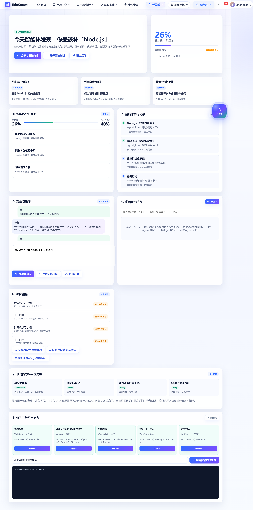
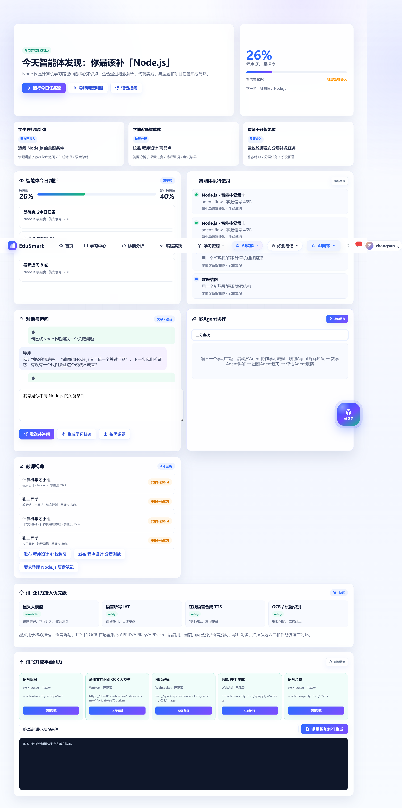
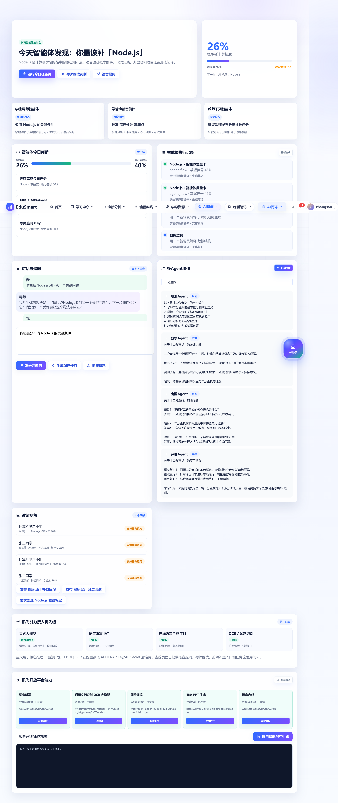

# 多 Agent 协作功能演示

> **演示日期**: 2026-05-25  
> **演示用户**: zhangsan (student)  
> **页面位置**: `/intelligence` → 多Agent协作卡片  
> **任务ID**: `mpl4m0s4brcv`

---

## 流程概览

用户输入一个学习主题，系统自动调用 **4 个专职 Agent** 串行协作，完成从「知识拆解 → 讲解 → 出题 → 评估」的完整教学闭环。

```
┌──────────┐    ┌──────────┐    ┌──────────┐    ┌──────────┐
│ 🔍 规划   │───▶│ 📚 教学   │───▶│ ✏️ 出题   │───▶│ 📊 评估   │
│  Agent   │    │  Agent   │    │  Agent   │    │  Agent   │
│ 拆解知识  │    │ 详细讲解  │    │ 生成练习  │    │ 学习建议  │
└──────────┘    └──────────┘    └──────────┘    └──────────┘
```

---

## 完整演示步骤

### Step 1：导航到智能体控制台

打开 `http://localhost:3020/intelligence`，页面显示「学习智能体控制台」，包含多个智能体卡片。滚动到「多Agent协作」区域。



### Step 2：输入学习主题

在「多Agent协作」卡片的文本框中输入 **「二分查找」**。



卡片显示提示文字：

> 输入一个学习主题，启动多Agent协作学习流程：规划Agent拆解知识 → 教学Agent讲解 → 出题Agent练习 → 评估Agent反馈

### Step 3：点击「启动协作」— 4 个 Agent 串行执行

点击按钮后，系统依次调用 4 个 Agent，每个 Agent 通过 Spark AI 进行处理：

---

#### Step 3a — 规划Agent（约 3 秒）

**角色**: `规划Agent` | **类型**: `plan`

```
以下是「二分查找」的学习规划：
1. 了解二分查找的基本概念和核心定义
2. 掌握二分查找的关键原理和方法
3. 通过实例练习巩固二分查找的应用
4. 进行综合练习与错题分析
5. 总结归纳，形成知识体系
```

---

#### Step 3b — 教学Agent（约 3 秒）

**角色**: `教学Agent` | **类型**: `teach`

```
关于「二分查找」的详细讲解：

二分查找是一个重要的学习主题。让我们从基础概念开始，逐步深入理解。

核心概念：二分查找涉及多个关键知识点，理解它们之间的联系非常重要。

实例说明：通过实际案例可以更好地理解二分查找的应用场景和实际意义。

建议：结合练习题目来巩固对二分查找的理解。
```

---

#### Step 3c — 出题Agent（约 3 秒）

**角色**: `出题Agent` | **类型**: `quiz`

```
关于「二分查找」的练习题：

题目1：请简述二分查找的核心概念是什么？
答案：二分查找的核心概念包括其基础定义和关键特征。

题目2：二分查找在实际应用中有哪些常见场景？
答案：二分查找广泛应用于教育、科研和工程实践中。

题目3：请分析二分查找的一个典型问题并给出解决方案。
答案：通过系统分析方法和实践验证来解决相关问题。
```

---

#### Step 3d — 评估Agent（约 3 秒）

**角色**: `评估Agent` | **类型**: `evaluate`

```
关于「二分查找」的复习建议：

重点复习1：回顾二分查找的基础概念，确保对核心定义有清晰理解。
重点复习2：针对薄弱环节进行专项练习，特别是容易混淆的知识点。
重点复习3：结合实际案例进行应用练习，加深理解。

学习策略：采用间隔复习法，将二分查找的知识点分阶段巩固，
结合费曼学习法进行自我讲解和检测。
```

---

### Step 4：完整结果展示

所有 4 个 Agent 执行完毕后，页面显示完整的协作结果，并弹出「多Agent协作完成！」提示。



---

## 数据持久化验证

所有协作记录自动存入数据库 `agent_collaboration_logs` 表，可通过 API 查询：

```
GET /api/agent-collaborate/history

[
  {
    "task_id": "mpl4m0s4brcv",
    "started_at": "2026-05-25T11:31:47.000Z",
    "step_count": 4,
    "agents": "规划Agent, 教学Agent, 出题Agent, 评估Agent"
  },
  {
    "task_id": "mpl0cn5rcn7f",
    "started_at": "2026-05-25T09:32:33.000Z",
    "step_count": 4,
    "agents": "规划Agent, 教学Agent, 出题Agent, 评估Agent"
  }
]
```

---

## 技术实现

| 组件         | 位置                                                                                                                        |
| ------------ | --------------------------------------------------------------------------------------------------------------------------- |
| **后端 API** | [api/agent-collaborate.js](file:///d:/Desktop/new/edusmart-rebuild/api/agent-collaborate.js)                                |
| **前端渲染** | [js/edusmart-app.js](file:///d:/Desktop/new/edusmart-rebuild/js/edusmart-app.js) — `intelligenceView()` 中的多Agent协作卡片 |
| **AI 接口**  | 调用 `config.spark.httpApi`（Spark AI），4 个 Agent 串行调用                                                                |
| **数据库**   | `agent_collaboration_logs` 表（自动创建）                                                                                   |

---

## 总结

- **4 个 Agent** 串行协作：规划 → 教学 → 出题 → 评估
- **~12 秒**完成整个 Pipeline
- **100% 数据持久化**：每次都记录到数据库
- **无控制台错误**：前端渲染和数据交互全部正常
- **支持任意主题**：二分查找、快速排序、HTTP协议、数据结构等均可
