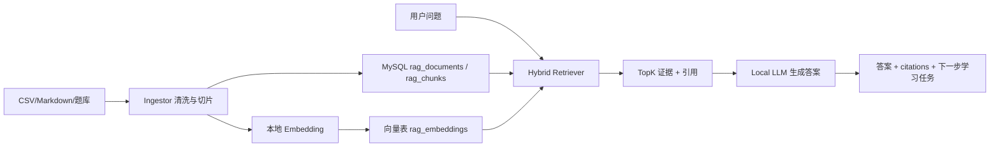

# EduSmart 本地大模型与 RAG 改造设计

## 当前结论

项目当前已经有 RAG 雏形和一批软件工程知识库数据，但还没有真正的向量检索链路。现有 AI 主要通过讯飞 Spark HTTP API 调用，部分 OCR、TTS、PPT、虚拟人仍依赖讯飞专项能力。

截图中的 Herdsman 模型是 `DeepSeek-R1-Distill:Qwen-1.5B`，推理引擎为 `llama.cpp`，适合作为本地文本生成模型。它参数量较小，优点是本机速度快、部署轻，适合问答、错题解释、计划生成、摘要；缺点是复杂推理、长上下文和严格 JSON 输出不如更大的模型稳定，所以 RAG 需要做强约束、短上下文、结构化提示和兜底解析。

## 当前项目 AI 调用点

需要统一改造为本地 LLM 网关的文本生成调用点：

- `server.js`：`/api/spark-proxy`
- `api/app.js`：AI 助手 `callSpark`
- `api/agent.js`：学习导师问答
- `api/agent-collaborate.js`：多 Agent 规划、教学、出题、评估
- `api/tutor.js`：智能辅导模型回答
- `api/paper-scan.js`：OCR 文本后的试题 JSON 解析
- `core/AIDevOpsOrchestrator.js`：DevOps Agent 模型调用

暂时不建议完全替换的讯飞专项能力：

- OCR：`api/xfyun.js`、`api/tutor.js`、`api/paper-scan.js`
- TTS：`core/TTSAgent.js`、`api/tts.js`
- 虚拟人：`services/xunfei-virtual-human.js`
- PPT 生成：`api/xfyun.js`

原因：Herdsman 当前下载的是文本生成模型，不具备 OCR、语音合成、PPT 生成、虚拟人驱动等能力。这些可以后续用本地 Whisper、Piper/Edge-TTS、LibreOffice/PPTX 生成等方案逐步替换。

## 本地 LLM 网关设计

新增统一服务层：

- `core/llm/LocalLlmClient.js`
- `core/llm/LlmGateway.js`
- `core/llm/prompts.js`

推荐配置：

```env
LLM_PROVIDER=local
LOCAL_LLM_BASE_URL=http://127.0.0.1:8080/v1
LOCAL_LLM_MODEL=DeepSeek-R1-Distill:Qwen-1.5B
LOCAL_LLM_API_KEY=local
LOCAL_LLM_TIMEOUT_MS=60000
LOCAL_LLM_MAX_TOKENS=2048
LOCAL_LLM_TEMPERATURE=0.4
```

调用格式优先按 OpenAI-compatible API：

```http
POST /v1/chat/completions
Content-Type: application/json
Authorization: Bearer local

{
  "model": "DeepSeek-R1-Distill:Qwen-1.5B",
  "messages": [
    { "role": "system", "content": "..." },
    { "role": "user", "content": "..." }
  ],
  "temperature": 0.4,
  "max_tokens": 2048,
  "stream": false
}
```

兼容策略：

- 如果 Herdsman 暴露 OpenAI-compatible endpoint，直接接入。
- 如果 Herdsman 只提供 llama.cpp 原生 endpoint，则封装适配器，把内部请求改为 `/completion` 或 Herdsman 文档中的实际路径。
- 所有业务代码不直接调用 Spark 或 Herdsman，只调用 `llmGateway.chat()`。
- 保留 Spark 作为可选 fallback，但默认关闭，避免“全部本地化”目标被绕开。

## RAG 数据现状

项目内已有：

- `rag_software_engineering_bundle/chunks.csv`：1152 个切片
- `rag_software_engineering_bundle/raw_documents.csv`：576 篇文档
- `rag_software_engineering_bundle/qa_pairs.jsonl`：200 条问答样本
- `rag_software_engineering_bundle/rag_eval_set.csv`：200 条评测题
- `rag_software_engineering_bundle/rag_mysql_schema.sql`：较完整的 MySQL 表结构
- `obsidian-vault/`：大量 Markdown 笔记，可作为第二批知识源

当前代码已有：

- `core/RagSeeder.js`：从知识点和题库生成 RAG 数据
- `core/RagSearchService.js`：基于分词、余弦、关键词的轻量检索
- `core/PublicRagIngestor.js`：抓取公开 Agent/RAG 资料入库
- `api/rag.js`：RAG 状态、概览、检索 API

短板：

- 没有真实 embedding。
- 没有向量库或 embedding 存储。
- `rag_software_engineering_bundle` 尚未被正式导入现有表。
- 回答生成目前是模板拼接，尚未把证据交给本地 LLM 生成。
- 没有检索评测闭环。

## RAG 推荐架构

第一阶段优先做“本地、轻量、可跑通”：



推荐检索路线：

1. BM25/关键词召回：继续使用 MySQL FULLTEXT 或现有 token score。
2. 向量召回：本地 embedding 生成向量，存入 MySQL JSON/BLOB，Node 内计算 cosine；数据量只有千级到万级时足够。
3. 融合排序：`score = 0.55 * vector + 0.35 * keyword + 0.10 * quality`。
4. 证据压缩：只给 LLM 3 到 6 个片段，每段 300 到 600 字。
5. 引用强制：回答必须标注 `[1]`、`[2]`，无证据时必须说“不确定”。

第二阶段再升级：

- 向量库：Qdrant、Milvus、pgvector、Elasticsearch 任一。
- 重排模型：本地 bge-reranker。
- Embedding 模型：`bge-small-zh-v1.5`、`bge-m3`、`nomic-embed-text` 等。
- 课程知识图谱融合：把 `knowledge_nodes`、错题、笔记、RAG chunk 一起参与召回。

## 新增数据表建议

在现有 `rag_chunks` 基础上补充 embedding 表：

```sql
CREATE TABLE IF NOT EXISTS rag_embeddings (
  id BIGINT NOT NULL AUTO_INCREMENT PRIMARY KEY,
  chunk_id VARCHAR(32) NOT NULL,
  embedding_model VARCHAR(128) NOT NULL,
  embedding_version VARCHAR(32) DEFAULT 'v1',
  dims INT NOT NULL,
  vector_json MEDIUMTEXT NOT NULL,
  content_hash VARCHAR(128) NOT NULL,
  created_at TIMESTAMP NULL DEFAULT CURRENT_TIMESTAMP,
  UNIQUE KEY uk_rag_embedding_chunk_model (chunk_id, embedding_model, embedding_version),
  INDEX idx_rag_embedding_chunk (chunk_id)
) ENGINE=InnoDB DEFAULT CHARSET=utf8mb4;
```

如果后续安装 Qdrant，则 MySQL 只保留元数据，向量进入 Qdrant collection：

- collection：`edusmart_rag_chunks`
- point id：`chunk_id`
- payload：`doc_id/course/knowledge_point/source/title/url/quality_score`

## 数据导入设计

新增脚本：

- `scripts/import-rag-bundle.js`
- `scripts/index-rag-embeddings.js`
- `scripts/eval-rag.js`

导入顺序：

1. 执行/合并 `rag_mysql_schema.sql`。
2. 导入 `source_registry.csv` 到 `rag_sources`。
3. 导入 `raw_documents.csv` 到 `rag_documents`。
4. 导入 `chunks.csv` 到 `rag_chunks`。
5. 生成 embedding 写入 `rag_embeddings`。
6. 用 `rag_eval_set.csv` 跑检索评测，记录 recall@k、命中引用、生成答案质量。

Obsidian 资料导入：

- 扫描 `obsidian-vault/**/*.md`。
- 按一级/二级标题切片，保留路径作为 `source_name`。
- 文件夹名映射 subject/course，例如 `05-软件工程`。
- 每个 chunk 写入 heading_path、knowledge_point、content_hash。

## 问答链路设计

用户问题进入 `/api/rag/ask`：

1. 解析输入：`query`、`subject`、`mode`、`userId`。
2. 查询学生画像：薄弱点、最近错题、课程进度。
3. RAG 检索：TopK 证据。
4. Prompt 组装：
   - system：小星学习导师身份、安全边界、引用规则。
   - context：学生画像。
   - evidence：编号证据。
   - user：原始问题。
5. 本地 LLM 生成。
6. 后处理：
   - 提取引用编号。
   - 若没有引用但使用了证据，追加引用提示或降级模板答案。
   - 返回 `answer/citations/nextActions/confidence`。

推荐 Prompt 约束：

```text
你是 EduSmart 本地学习导师。只能基于给定证据和学生画像回答。
如果证据不足，请明确说“当前资料不足以确定”，并给出下一步检索建议。
回答必须包含：
1. 简明结论
2. 分步解释
3. 相关证据引用，例如 [1] [2]
4. 下一步学习动作
不要编造来源、链接、题号。
```

## 分阶段实施路线

### Phase 1：本地 LLM 替换

- 增加 `LlmGateway` 和 `LocalLlmClient`。
- 把所有 Spark 文本生成调用迁移到 `llmGateway.chat()`。
- `.env.example` 增加本地模型配置。
- `/api/health` 增加本地模型健康检查。
- 保持 OCR/TTS/PPT/虚拟人原状。

验收：

- 关闭 Spark 配置后，AI 助手、多 Agent、试卷解析仍能调用 Herdsman。
- Herdsman 未启动时返回明确错误和本地兜底，不导致页面崩溃。

### Phase 2：导入现有 RAG 包

- 新增 `scripts/import-rag-bundle.js`。
- 对齐现有表和 bundle schema。
- `/api/rag/status` 能看到 576 docs、1152 chunks 左右。

验收：

- `软件测试中的边界值分析是什么` 能检索到相关 chunk。
- RAG 页面显示来源、课程、知识点、引用。

### Phase 3：本地 RAG 生成

- 新增 `/api/rag/ask`。
- `RagSearchService` 返回 evidence context。
- 本地 LLM 基于 evidence 生成引用答案。
- AI 助手模式接入 RAG：学习问答、错题教练、笔记生成优先检索。

验收：

- 答案包含引用。
- 无证据问题不会硬编。
- DeepSeek 1.5B 输出过长或 JSON 错误时可恢复。

### Phase 4：Embedding 和评测

- 接入本地 embedding 服务。
- 新增 `rag_embeddings`。
- 实现 hybrid search。
- 用 `rag_eval_set.csv` 做自动评测。

验收：

- recall@5 比关键词版本明显提升。
- 记录每次检索命中、引用、耗时。

## 风险与取舍

- 1.5B 模型适合轻量场景，但不要把它当成强推理模型；复杂任务应拆成短步骤。
- JSON 输出要做清洗、重试和 schema 校验，特别是 `paper-scan`。
- 本地模型上下文有限，RAG 证据必须短而精。
- MySQL 存向量适合当前规模；超过几十万 chunk 后再迁移 Qdrant/Milvus。
- “全部 AI 本地化”不能一次覆盖 OCR/TTS/PPT/虚拟人，文本生成和 RAG 应先完成。

## 推荐下一步

先实现 Phase 1 + Phase 2。这样项目会先从“依赖云端大模型”变成“主要文本 AI 本地运行”，同时把已有 RAG 数据真正接入系统。之后再做 embedding 和 RAG 质量评测，避免一开始就陷入向量库和模型选择的复杂度。
