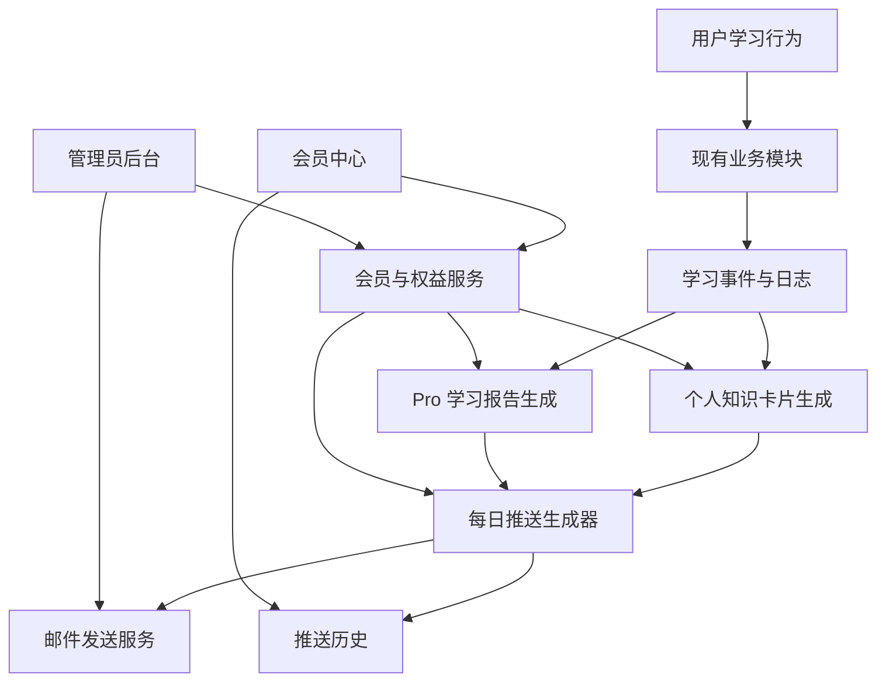
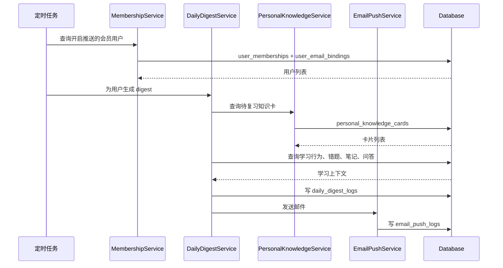

# EduSmart 会员增值与每日知识推送系统设计文档

## 1. 设计目标

在 EduSmart 现有系统基础上新增会员增值、每日知识推送、个人知识库增强和 Pro 学习报告能力。

本设计遵循以下原则：

- 不改变现有核心功能的可用性。
- 新增模块与现有功能松耦合。
- 通过权益判断控制增值能力，而不是硬性削减普通用户能力。
- 支持先落地 MVP，再接入真实支付和邮件服务。

## 2. 总体架构



## 3. 模块划分

### 3.1 MembershipService

负责用户会员状态、套餐、到期时间和权益判断。

职责：

- 查询用户当前会员状态。
- 判断用户是否拥有某项增值权益。
- 处理模拟开通、续费、到期。
- 为后续真实支付回调提供状态更新入口。

核心方法：

```js
getUserMembership(userId)
hasEntitlement(userId, featureKey)
activateMembership(userId, planCode, source)
expireMembership(userId)
```

### 3.2 EntitlementService

负责功能权益配置。

职责：

- 维护套餐和功能的映射关系。
- 判断某功能对当前用户的展示状态。
- 返回普通能力、会员增强能力说明。

功能 Key 示例：

- `daily_knowledge_push`
- `personal_knowledge_auto_cards`
- `pro_weekly_report`
- `pro_monthly_report`
- `advanced_screenshot_analysis`
- `mistake_training_camp`
- `multi_agent_study_group`
- `teacher_class_insight`

### 3.3 PersonalKnowledgeService

负责生成和管理个人知识卡片。

职责：

- 从 AI 问答提取知识卡片。
- 从截图解析提取题目卡片。
- 从错题解析提取错因卡片。
- 从智能笔记提取复习卡片。
- 计算待复习优先级。

卡片结构：

- 标题。
- 摘要。
- 知识点。
- 来源类型。
- 来源 ID。
- 主动回忆问题。
- 掌握状态。
- 下次复习时间。

### 3.4 DailyDigestService

负责生成每日知识推送。

职责：

- 汇总用户最近学习行为。
- 选择今日推荐知识点。
- 选择待复习知识卡。
- 生成主动回忆题。
- 生成下一步行动。
- 保存推送记录。

生成策略：

1. 优先选近期错题和薄弱知识点。
2. 其次选近期 AI 高频提问主题。
3. 再选学习路径中未完成任务。
4. 最后补充长期未复习卡片。

### 3.5 EmailPushService

负责邮件发送。

职责：

- 渲染邮件模板。
- 调用邮件服务商。
- 记录发送结果。
- 支持失败重试。
- 支持取消订阅。

MVP 阶段可先不接真实邮件服务，改为写入 `email_push_logs` 并在会员中心展示。

### 3.6 BillingService

负责订单和支付生命周期。

MVP 阶段支持模拟开通：

- 创建模拟订单。
- 标记支付成功。
- 激活会员。

后续扩展：

- 微信支付。
- 支付宝。
- Stripe。
- 企业线下付款。

### 3.7 ProReportService

负责生成会员深度报告。

职责：

- 生成周报。
- 生成月报。
- 生成阶段报告。
- 生成 PDF / Word 导出数据。
- 记录报告历史。

## 4. 数据库设计

### 4.1 membership_plans

套餐表。

```sql
CREATE TABLE membership_plans (
    id INT AUTO_INCREMENT PRIMARY KEY,
    code VARCHAR(60) NOT NULL UNIQUE,
    name VARCHAR(120) NOT NULL,
    description TEXT,
    price_cents INT DEFAULT 0,
    currency VARCHAR(12) DEFAULT 'CNY',
    billing_cycle VARCHAR(30) DEFAULT 'monthly',
    is_active TINYINT DEFAULT 1,
    created_at TIMESTAMP DEFAULT CURRENT_TIMESTAMP,
    updated_at TIMESTAMP DEFAULT CURRENT_TIMESTAMP ON UPDATE CURRENT_TIMESTAMP
) ENGINE=InnoDB DEFAULT CHARSET=utf8mb4;
```

### 4.2 membership_entitlements

套餐权益表。

```sql
CREATE TABLE membership_entitlements (
    id INT AUTO_INCREMENT PRIMARY KEY,
    plan_code VARCHAR(60) NOT NULL,
    feature_key VARCHAR(100) NOT NULL,
    feature_name VARCHAR(120) NOT NULL,
    config_json JSON NULL,
    created_at TIMESTAMP DEFAULT CURRENT_TIMESTAMP,
    UNIQUE KEY uniq_plan_feature (plan_code, feature_key)
) ENGINE=InnoDB DEFAULT CHARSET=utf8mb4;
```

### 4.3 user_memberships

用户会员状态表。

```sql
CREATE TABLE user_memberships (
    id INT AUTO_INCREMENT PRIMARY KEY,
    user_id INT NOT NULL,
    plan_code VARCHAR(60) NOT NULL,
    status VARCHAR(30) DEFAULT 'active',
    started_at DATETIME NOT NULL,
    expires_at DATETIME NULL,
    source VARCHAR(40) DEFAULT 'manual',
    created_at TIMESTAMP DEFAULT CURRENT_TIMESTAMP,
    updated_at TIMESTAMP DEFAULT CURRENT_TIMESTAMP ON UPDATE CURRENT_TIMESTAMP,
    INDEX idx_user_status (user_id, status),
    INDEX idx_expires_at (expires_at)
) ENGINE=InnoDB DEFAULT CHARSET=utf8mb4;
```

### 4.4 user_email_bindings

邮箱绑定表。

```sql
CREATE TABLE user_email_bindings (
    id INT AUTO_INCREMENT PRIMARY KEY,
    user_id INT NOT NULL,
    email VARCHAR(180) NOT NULL,
    verified TINYINT DEFAULT 0,
    verify_token_hash VARCHAR(128) NULL,
    verify_expires_at DATETIME NULL,
    push_enabled TINYINT DEFAULT 0,
    push_time VARCHAR(20) DEFAULT '08:00',
    unsubscribed_at DATETIME NULL,
    created_at TIMESTAMP DEFAULT CURRENT_TIMESTAMP,
    updated_at TIMESTAMP DEFAULT CURRENT_TIMESTAMP ON UPDATE CURRENT_TIMESTAMP,
    UNIQUE KEY uniq_user_email (user_id, email),
    INDEX idx_push_enabled (push_enabled, verified)
) ENGINE=InnoDB DEFAULT CHARSET=utf8mb4;
```

### 4.5 personal_knowledge_cards

个人知识卡片表。

```sql
CREATE TABLE personal_knowledge_cards (
    id INT AUTO_INCREMENT PRIMARY KEY,
    user_id INT NOT NULL,
    title VARCHAR(220) NOT NULL,
    summary TEXT,
    subject VARCHAR(80) NULL,
    knowledge_point VARCHAR(160) NULL,
    recall_question TEXT,
    source_type VARCHAR(60) NOT NULL,
    source_id VARCHAR(120) NULL,
    mastery_state VARCHAR(40) DEFAULT 'new',
    priority_score DECIMAL(6,2) DEFAULT 0,
    next_review_at DATETIME NULL,
    last_reviewed_at DATETIME NULL,
    metadata_json JSON NULL,
    created_at TIMESTAMP DEFAULT CURRENT_TIMESTAMP,
    updated_at TIMESTAMP DEFAULT CURRENT_TIMESTAMP ON UPDATE CURRENT_TIMESTAMP,
    INDEX idx_user_review (user_id, next_review_at),
    INDEX idx_user_priority (user_id, priority_score)
) ENGINE=InnoDB DEFAULT CHARSET=utf8mb4;
```

### 4.6 daily_digest_logs

每日推送内容表。

```sql
CREATE TABLE daily_digest_logs (
    id INT AUTO_INCREMENT PRIMARY KEY,
    user_id INT NOT NULL,
    digest_date DATE NOT NULL,
    title VARCHAR(220) NOT NULL,
    summary TEXT,
    recommended_points_json JSON NULL,
    cards_json JSON NULL,
    recall_questions_json JSON NULL,
    next_actions_json JSON NULL,
    status VARCHAR(30) DEFAULT 'generated',
    generated_at DATETIME NOT NULL,
    created_at TIMESTAMP DEFAULT CURRENT_TIMESTAMP,
    UNIQUE KEY uniq_user_digest_date (user_id, digest_date)
) ENGINE=InnoDB DEFAULT CHARSET=utf8mb4;
```

### 4.7 email_push_logs

邮件推送日志表。

```sql
CREATE TABLE email_push_logs (
    id INT AUTO_INCREMENT PRIMARY KEY,
    user_id INT NOT NULL,
    digest_id INT NULL,
    email VARCHAR(180) NOT NULL,
    status VARCHAR(30) DEFAULT 'pending',
    provider VARCHAR(60) NULL,
    provider_message_id VARCHAR(160) NULL,
    error_message TEXT NULL,
    sent_at DATETIME NULL,
    created_at TIMESTAMP DEFAULT CURRENT_TIMESTAMP,
    INDEX idx_user_created (user_id, created_at),
    INDEX idx_status (status)
) ENGINE=InnoDB DEFAULT CHARSET=utf8mb4;
```

### 4.8 billing_orders

订单表。

```sql
CREATE TABLE billing_orders (
    id INT AUTO_INCREMENT PRIMARY KEY,
    order_no VARCHAR(80) NOT NULL UNIQUE,
    user_id INT NOT NULL,
    plan_code VARCHAR(60) NOT NULL,
    amount_cents INT NOT NULL,
    currency VARCHAR(12) DEFAULT 'CNY',
    status VARCHAR(30) DEFAULT 'created',
    payment_provider VARCHAR(40) DEFAULT 'manual',
    paid_at DATETIME NULL,
    metadata_json JSON NULL,
    created_at TIMESTAMP DEFAULT CURRENT_TIMESTAMP,
    updated_at TIMESTAMP DEFAULT CURRENT_TIMESTAMP ON UPDATE CURRENT_TIMESTAMP,
    INDEX idx_user_status (user_id, status)
) ENGINE=InnoDB DEFAULT CHARSET=utf8mb4;
```

## 5. 后端 API 设计

### 5.1 查询会员状态

`GET /api/membership/status`

返回：

```json
{
  "success": true,
  "data": {
    "isMember": true,
    "planCode": "student_pro",
    "planName": "Pro 学习教练",
    "expiresAt": "2026-07-17T00:00:00.000Z",
    "entitlements": ["daily_knowledge_push", "pro_weekly_report"]
  }
}
```

### 5.2 模拟开通会员

`POST /api/membership/activate-demo`

请求：

```json
{
  "planCode": "student_pro"
}
```

说明：MVP 阶段用于跑通链路，后续由支付成功回调触发。

### 5.3 绑定邮箱

`POST /api/membership/email/bind`

请求：

```json
{
  "email": "student@example.com"
}
```

### 5.4 验证邮箱

`POST /api/membership/email/verify`

请求：

```json
{
  "email": "student@example.com",
  "code": "123456"
}
```

### 5.5 更新推送设置

`POST /api/membership/push-settings`

请求：

```json
{
  "pushEnabled": true,
  "pushTime": "08:00"
}
```

### 5.6 生成每日推送

`POST /api/daily-digest/generate`

请求：

```json
{
  "date": "2026-06-17"
}
```

说明：用户手动生成或定时任务调用。

### 5.7 查询推送历史

`GET /api/daily-digest/recent?limit=10`

### 5.8 发送测试邮件

`POST /api/daily-digest/send-test`

说明：用于用户验证邮箱推送效果，也用于管理员调试。

### 5.9 查询个人知识卡

`GET /api/personal-knowledge/cards?status=due&limit=20`

### 5.10 从 AI 回答生成知识卡

`POST /api/personal-knowledge/cards/from-ai`

请求：

```json
{
  "sourceId": "ai_1781707168470_fio373",
  "answer": "递归是一种..."
}
```

## 6. 前端页面设计

### 6.1 会员中心页面

页面路径建议：`/membership`

区域：

- 当前会员状态。
- 套餐权益。
- 每日推送设置。
- 邮箱绑定状态。
- 最近推送历史。
- Pro 能力入口。

普通用户展示：

- 当前基础版权益。
- Pro 能力预览。
- 模拟开通或升级入口。

会员用户展示：

- 到期时间。
- 推送开关。
- 推送历史。
- 个人知识库增强状态。

### 6.2 普通用户与会员用户的体验差异

普通用户：

- 所有当前主功能正常可用。
- 在完成 AI 问答、笔记、截图后看到“可加入每日复习”的轻提示。
- 可进入会员中心查看增强能力。

会员用户：

- AI 回答后可自动生成知识卡。
- 每日推送入口常驻展示。
- 学习报告显示完整趋势。
- 个人知识库显示自动沉淀结果。

### 6.3 付费提示组件

统一使用“增强提示”组件，不使用强制遮挡式弹窗。

示例文案：

- “已生成基础建议。Pro 可自动整理为每日复习邮件。”
- “这次截图解析可加入错题训练营，明天自动推送变式题。”
- “升级后系统会每天主动帮你复盘，而不是等你来问。”

## 7. 每日推送生成流程



## 8. 邮件模板设计

邮件标题：

`你的 EduSmart 今日知识推送：{{mainKnowledgePoint}}`

邮件结构：

1. 今日问候。
2. 昨日学习摘要。
3. 今日推荐知识点。
4. 个人知识卡片。
5. 主动回忆题。
6. 下一步动作。
7. 回到系统按钮。
8. 取消订阅链接。

示例：

```text
今天建议你复习：递归的终止条件

昨日你询问了“递归”和“冒泡排序”，其中递归问题已经形成知识卡。

知识卡：
递归 = 函数调用自身，把大问题拆成同类小问题，直到触发终止条件。

主动回忆：
为什么递归函数必须有终止条件？

下一步动作：
用 10 分钟写一个 factorial 函数，并在 EduSmart 中保存为练习笔记。
```

## 9. 权益判断策略

后端判断为准，前端只做展示。

```js
async function requireEntitlement(userId, featureKey) {
    const membership = await membershipService.getUserMembership(userId);
    if (!membership.active) return false;
    return membership.entitlements.includes(featureKey);
}
```

对于普通用户：

- 不阻断现有功能。
- 返回基础结果。
- 可附带 `proSuggestion` 字段。

示例：

```json
{
  "success": true,
  "data": {
    "answer": "基础 AI 回答内容",
    "proSuggestion": {
      "title": "加入每日复习",
      "message": "会员可将本次回答自动整理成知识卡，并在明天邮件推送。"
    }
  }
}
```

## 10. 定时任务设计

建议新增脚本：

`scripts/run-daily-digest.js`

运行方式：

```bash
node scripts/run-daily-digest.js
```

服务端可使用 `node-cron`：

```js
cron.schedule("0 8 * * *", async () => {
    await dailyDigestJob.run({ pushTime: "08:00" });
});
```

MVP 阶段也可只提供手动触发接口，避免推送误发。

## 11. 开发落地顺序

### 阶段一：基础链路

1. 新增数据库迁移。
2. 新增 membership 模块。
3. 新增会员中心页面。
4. 新增邮箱绑定和推送设置。
5. 新增每日推送生成接口。
6. 新增推送历史查看。

### 阶段二：知识卡片增强

1. 新增 personal-knowledge 模块。
2. AI 问答后生成知识卡。
3. 笔记和错题生成知识卡。
4. 每日推送使用知识卡。

### 阶段三：Pro 报告

1. 新增周报/月报生成。
2. 增加趋势图和风险预警。
3. 支持导出 PDF / Word。

### 阶段四：商业化完善

1. 接入真实支付。
2. 支持自动续费。
3. 支持机构版套餐。
4. 支持管理员运营后台。

## 12. 测试方案

### 12.1 单元测试

- 会员状态判断。
- 权益判断。
- 邮箱脱敏。
- 知识卡片生成。
- 每日推送内容排序。

### 12.2 接口测试

- 查询会员状态。
- 模拟开通会员。
- 绑定邮箱。
- 开启每日推送。
- 生成每日摘要。
- 查询推送历史。

### 12.3 集成测试

- 用户开通会员后开启推送。
- AI 问答生成知识卡。
- 知识卡进入每日推送。
- 邮件发送日志写入。

### 12.4 体验测试

- 普通用户现有功能不受影响。
- 会员用户能看到新增增强能力。
- 付费提示不遮挡主流程。

## 13. 兼容现有系统的注意事项

- 不修改现有 AI 问答入口的基本能力。
- 不修改现有学习路径的普通可用性。
- 不修改现有截图对话的基本能力。
- 新增功能通过独立路由、独立表和独立状态接入。
- 前端新增会员中心和增强提示，不替换现有页面。

## 14. 配置项

建议新增 `.env` 配置：

```env
MEMBERSHIP_DEMO_ENABLED=true
DAILY_DIGEST_ENABLED=false
DAILY_DIGEST_DEFAULT_TIME=08:00
EMAIL_PROVIDER=log
EMAIL_FROM=EduSmart <noreply@edusmart.local>
SMTP_HOST=
SMTP_PORT=587
SMTP_USER=
SMTP_PASSWORD=
APP_PUBLIC_URL=http://localhost:3020
```

## 15. 风险控制

- 每日推送默认关闭，用户主动开启。
- MVP 邮件 provider 默认为 `log`，避免误发。
- 会员开通先支持模拟模式，真实支付后接。
- AI 生成内容保存前增加长度限制和异常兜底。
- 邮件包含取消订阅入口。

